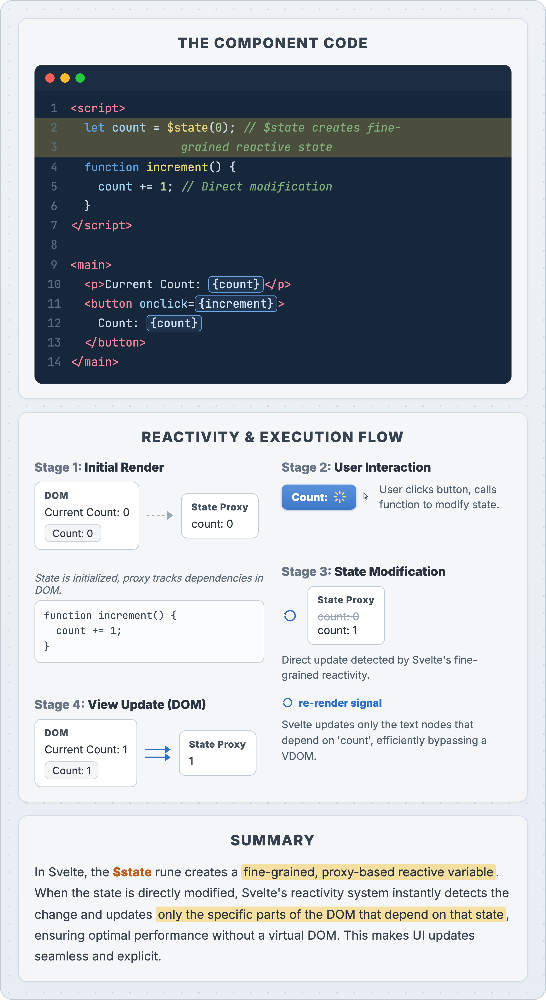

# Example: a markdown file with a Pencil figure inside

This is what the final lecture / booklet / Q&A files look like — plain Markdown with a
standard image reference. Publishes online and prints unchanged.

The `$state` rune turns a plain variable into a fine-grained reactive value. The figure
below traces the full loop: initial render, the click, the state mutation, and the
surgical DOM update.

That image was authored as `cards/01-state-reactivity/card.html` and rendered
deterministically by `render.mjs` — no hand-drawing, no AI guesswork, fully reproducible.
