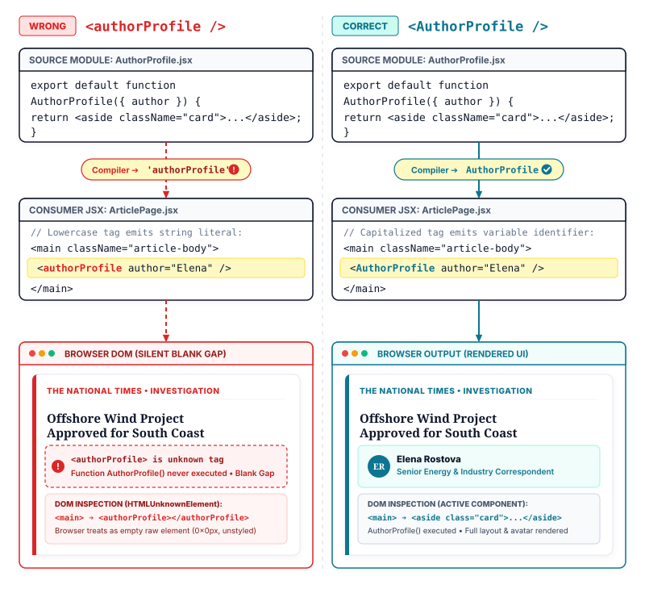

# Lecture 3: Component Anatomy and the Rules of Components
> INTERVIEW QUESTION | ❱ CORE | What is a React component, and what rules govern how you write one?

1. A web developer builds an author profile for a breaking news report on the National Times website. The newsroom requires every report to credit the author with a photo and name.
2. The article page shows one author badge below the headline. That badge displays the author photo and name, because the newsroom requires every report to credit the author.
3. The developer writes a function named `authorProfile` with a lowercase b to return that badge.
4. Why does the browser show an empty space instead of calling your function?
5. The news report publishes to readers with a blank gap where the author credit belongs.
6. The browser treated the lowercase word as an unknown HTML tag instead of executing your code.
7. Today you learn what a React component really is and the rules governing how you write one.

### The Anatomy of a Custom User Interface

In earlier lessons, we learned that React replaces manual, imperative DOM queries with declarative blueprints (see Lecture 1). In the project setup, we configured modern build tools to compile and serve our files (see Lecture 2). Now you open your project editor to write your first visual building block. You create a JavaScript function that returns markup resembling HTML, and the browser displays it on screen.

What exactly is this function? In React, this foundational unit is called a **component** (a self-contained, reusable JavaScript function that accepts data inputs called props and returns markup describing a section of the user interface).

In traditional web development, web pages were divided by technology: HTML files handled document structure, CSS files handled styling, and separate JavaScript files queried DOM elements to attach behavior. React fundamentally reorganizes code by feature rather than technology. A React component unites markup, styling, and interactivity into a single, cohesive unit. Instead of writing separate templates and mutation scripts, you define the visual structure of a component once, and you can reuse that component across dozens of pages.

### Structuring a Feature: The National Times Article View

To understand how components collaborate in a real application, consider an article page on The National Times. A complete news article does not live as a single monolithic block of markup inside one file. Instead, we assemble the view from focused, modular components. The top-level shell `ArticlePage.jsx` provides the structural container for the page. Inside that layout, `ArticleHeadline.jsx` displays the category eyebrow and headline title, while `AuthorProfile.jsx` renders the author credit card directly below the headline.

```components title="national-times — Component Explorer"
ArticlePage.jsx | slug="harbor-strike" | shell
  ArticleHeadline.jsx | title="Port Harbor Strike Enters Second Day" | header | Breaking News;; Port Harbor Strike Enters Second Day
  AuthorProfile.jsx | author="Elena Rostova" | profile | Reported by **Elena Rostova**;; Senior Labor Correspondent
```

The component explorer panel above illustrates this hierarchy. On the left, the file tree displays `ArticlePage.jsx` holding both child components directly within `components/`. On the right, the rendered canvas shows the final visual output: `ArticleHeadline.jsx` renders the category badge "Breaking News" alongside the headline text "Port Harbor Strike Enters Second Day", while `AuthorProfile.jsx` renders the author credit "Reported by Elena Rostova" alongside her editorial title.

Here is the implementation of `ArticleHeadline.jsx`:

```jsx title="ArticleHeadline.jsx"
export default function ArticleHeadline({ title }) {
  return (
    <header className="headline-wrap">
      <span className="eyebrow">Breaking News</span> // **RIGHT:** static category rendered as a **BADGE**
      <h1>{title}</h1> // **RIGHT:** dynamic title injected from **PROPS**
    </header>
  );
}
```

Next, we define `AuthorProfile.jsx` to render the author credit card:

```jsx title="AuthorProfile.jsx"
export default function AuthorProfile({ author }) {
  return (
    <aside className="profile-card">
      <p className="author-name">Reported by {author}</p> // **RIGHT:** single root element wraps author **TEXT**
      <p className="author-role">Senior Labor Correspondent</p> // **RIGHT:** static metadata stays **CONSISTENT**
    </aside>
  );
}
```

Finally, `ArticlePage.jsx` imports both child components and arranges them inside the application layout:

```jsx title="ArticlePage.jsx"
import ArticleHeadline from "./ArticleHeadline.jsx";
import AuthorProfile from "./AuthorProfile.jsx";

export default function ArticlePage() {
  return (
    <main className="article-layout">
      <ArticleHeadline title="Port Harbor Strike Enters Second Day" /> // **RIGHT:** passes headline prop to **HEADLINE**
      <AuthorProfile author="Elena Rostova" /> // **RIGHT:** passes author name to **PROFILE**
    </main>
  );
}
```

Examining these files reveals the universal anatomy of a React component:

1. **The Function Declaration**: The component is declared as a standard JavaScript function, typically using `export default function Name()`.
2. **The Props Input**: The function accepts a single object argument containing its configuration data, known as props.
3. **The Return Statement**: The function returns JSX markup describing what should appear on the screen.
4. **Parentheses Wrapping**: When the returned markup spans multiple lines, it must be wrapped in parentheses `return ( ... );`. In JavaScript, a line break immediately following the `return` keyword triggers **Automatic Semicolon Insertion (ASI)** (the browser parser rule where the JavaScript engine inserts an invisible semicolon after return, ignoring all following lines). Wrapping markup in parentheses prevents ASI by explicitly signaling that the expression continues onto the next line.
5. **The Single Root Requirement**: A component must return a single top-level element. JavaScript functions cannot return multiple values side by side without wrapping. If you need to return sibling tags without creating an unnecessary wrapper `<div>` in the browser DOM, you wrap them in a **Fragment** (a built-in React wrapper written as `<>...</>` that groups multiple sibling elements without creating an extra node in the real DOM).

### The Capitalization Rule: PascalCase versus Native HTML

The most common mistake new developers encounter is naming a component with a lowercase letter. If you write `function authorProfile()` and render `<authorProfile />`, your browser will not execute the function. Instead, it renders an empty, invisible `<authorProfile></authorProfile>` element.

Why does React insist that component names start with a capital letter? The reason stems directly from how JSX compiles into JavaScript. Browsers cannot execute JSX syntax natively. A build tool must compile every JSX tag into a JavaScript function call: `React.createElement()` or `jsx()`.

During compilation, the JSX compiler uses the first character of the tag name to determine what code to generate:

- If the tag name starts with a **lowercase letter** (such as `<article>`, `<header>`, or `<div>`), the compiler treats it as a native HTML element. It emits the tag name as a string literal: `React.createElement('header')`. At runtime, React passes that string directly to the browser DOM engine to create a native document element.
- If the tag name starts with an **uppercase letter** (such as `<ArticleHeadline>` or `<AuthorProfile>`), the compiler treats it as a custom component. It emits the name as a direct variable identifier: `React.createElement(AuthorProfile)`. At runtime, React executes that function to obtain its returned elements.

```jsx title="JSX Tag Casing Comparison"
<article className="card" /> // **RIGHT:** lowercase tag compiles to string 'article' for native **DOM**
<ArticleHeadline title="Port" /> // **RIGHT:** capitalized tag compiles to identifier ArticleHeadline as a **FUNCTION**
<authorProfile author="Elena" /> // **WRONG:** lowercase custom name compiles to string 'authorProfile' and ignores your **CODE**
```

If you render `<authorProfile />`, the compiler outputs `React.createElement('authorProfile')`. React assumes you are attempting to render a custom HTML tag called `<authorProfile>`. Because HTML allows unknown custom element names, the browser creates a generic HTML element in the DOM, leaves it completely unstyled, and never executes your JavaScript function.

> [!KEY]
> Capitalization is not a cosmetic style guide; it is the compiler switch between an HTML string and a JavaScript function reference.

When the JSX compiler encounters a lowercase tag like `<article>`, the lowercase first letter signals a native browser element, and the compiler outputs 'article' as a string literal. When it encounters an uppercase tag like `<ArticleHeadline>`, the capital letter signals a variable identifier in scope, instructing React to invoke your function. That single character determines whether React asks the browser to create a DOM node or executes your JavaScript logic.



### The Four Golden Rules of React Components

To write robust, predictable components, every React developer must follow four foundational rules:

1. **Always Use PascalCase for Component Names**: Every component function name must begin with an uppercase letter (`AuthorProfile`), and every JSX tag invoking that component must preserve that exact uppercase casing (`<AuthorProfile />`).
2. **Always Return a Single Root Element or Fragment**: Because JavaScript functions can return only one value at a time, every component must return a single top-level element. Use a Fragment `<>...</>` to group siblings without polluting the DOM with extraneous container wrappers.
3. **Keep Components Pure During Render**: A React component must behave like a pure mathematical formula: given the same inputs, it must always return the exact same JSX description. A component function must never mutate external variables, query the DOM directly, or trigger network requests during its render pass.
4. **Never Nest Component Definitions Inside Other Components**: While components can freely render other components through composition, you must never define a component function inside the body of another component function.

To understand why nested component declarations cause severe bugs, examine this flawed pattern:

```jsx title="Nested Component Definition Anti-Pattern"
export default function ArticlePage() {
  function AuthorProfile() { // **WRONG:** nested function redeclared at new memory address on every **RENDER**
    return <p>Reported by Elena Rostova</p>;
  }
  return (
    <main className="article-layout">
      <AuthorProfile />
    </main>
  );
}
```

In JavaScript, executing a function creates new local variables and new function instances. If you define `AuthorProfile` inside `ArticlePage`, every single time `ArticlePage` renders, JavaScript creates a brand-new `AuthorProfile` function in memory with a completely new reference address.

When React reconciles the element tree, it checks whether the component type at that position is identical to the previous render. Because the function reference changed, React assumes that the old component was deleted and replaced by a completely different component type. React unmounts the existing DOM subtree, completely destroys its physical DOM nodes, wipes out all local component state, loses text input focus, and forces the browser to recalculate layouts.

The correct approach is **component composition**: declare each component at the top level of its own file or module, and compose them together by rendering `<AuthorProfile />` inside `ArticlePage`'s JSX.

> [!TIP]
> **To impress the interviewer:** When asked why you must never declare a component inside another component, explain the difference between composition and nested definition. Composition means placing `<Child />` inside the JSX returned by `Parent`, which is the foundation of React. Nested definition means writing `function Child() {}` inside `function Parent() {}`. This redeclares the function at a new memory address on every parent render, forcing React to treat the child as an entirely new component type. React unmounts the old DOM node, wipes out all local state, loses input focus, and destroys performance. Components must always be declared at module scope.

### Where you will meet this

- Newsroom publication articles: The National Times breaks down stories into independent header, author profile, photo gallery, and comment section components across shared article layouts.
- E-commerce product catalogs: An online storefront defines a single reusable product card component and renders hundreds of instances across category grids.
- Financial trading dashboards: A stock ticker component encapsulates its own pricing badge and percentage indicator, updating cleanly whenever new quote data arrives.
- Video streaming interfaces: A media player shell composes separate playback controls, volume sliders, and playlist drawer components without tangling their layout markup.

### Summary

**Component Function Anatomy, PascalCase Grammar, and Invocation Rules**

In daily production, you build entire user interfaces by composing small, isolated component functions. Understanding how React distinguishes components from plain JavaScript functions and HTML elements prevents subtle runtime bugs. Here is your streetwise review.

❒ Component Anatomy and PascalCase

1. Every component is a JavaScript function that **returns JSX markup**.<br>&nbsp;&nbsp;&nbsp;&nbsp;**DO THIS:** Define component names in PascalCase starting with an uppercase letter.
```jsx right
export default function StoryCard() {
  return <h3>Breaking News</h3>;
}
```
&nbsp;&nbsp;&nbsp;&nbsp;**DO NOT DO THIS:** Never name a component with a lowercase first letter because JSX compiles lowercase tags into native HTML string literals.
```jsx wrong
export default function storyCard() {
  return <h3>Breaking News</h3>;
}
```
2. When returning multi-line JSX, **wrap the markup in parentheses**.<br>&nbsp;&nbsp;&nbsp;&nbsp;**DO THIS:** Place an opening parenthesis immediately after `return` to prevent Automatic Semicolon Insertion.
```jsx right
return (
  <article className="story">
    <h3>Offshore Wind</h3>
  </article>
);
```
&nbsp;&nbsp;&nbsp;&nbsp;**DO NOT DO THIS:** Placing JSX on a new line without parentheses returns `undefined` and renders nothing.
```jsx wrong
return
  <article className="story">
    <h3>Offshore Wind</h3>
  </article>;
```

❒ Module Scope and Encapsulation

1. Components must ALWAYS be defined at **top-level module scope**.<br>&nbsp;&nbsp;&nbsp;&nbsp;**DO THIS:** Define components side by side at the root of the module and nest them inside your JSX.
```jsx right
function AuthorBadge() {
  return <span>Sarah Jenkins</span>;
}
export default function Story() {
  return <article><AuthorBadge /></article>;
}
```
&nbsp;&nbsp;&nbsp;&nbsp;**DO NOT DO THIS:** Never nest a component function declaration inside another component body, which recreates the function on every render and wipes local state.
```jsx wrong
export default function Story() {
  function AuthorBadge() {
    return <span>Sarah Jenkins</span>;
  }
  return <article><AuthorBadge /></article>;
}
```

➔ ALWAYS name components in **PascalCase** so the compiler treats them as React components rather than native DOM elements.

➔ ALWAYS wrap multi-line JSX in **parentheses** directly after the `return` keyword to prevent Automatic Semicolon Insertion.

➔ NEVER declare a component **inside another component function**; keep definitions at module scope.

| | **REACT COMPONENT**<br>(UI Blueprint) | **NATIVE HTML ELEMENT**<br>(Browser Built-in) |
| ---: | :--- | :--- |
| **Naming convention** | PascalCase starting with a capital letter | Lowercase tag defined in the HTML standard |
| **Compiler output** | Variable identifier passed to React element function | String literal representing built-in tag name |
| **Return requirement** | Single root element or Fragment wrapped in parentheses | Native DOM node directly instantiated by the browser |
| **Input contract** | Receives a props object as its first argument | Accepts standard HTML attributes and DOM properties |
| **Internal capabilities** | Can encapsulate state, effects, and sub-components | Renders static structure unless manipulated by external scripts |
| **Declaration scope** | Declared at top-level module scope, never nested | Registered globally in the browser DOM engine |
