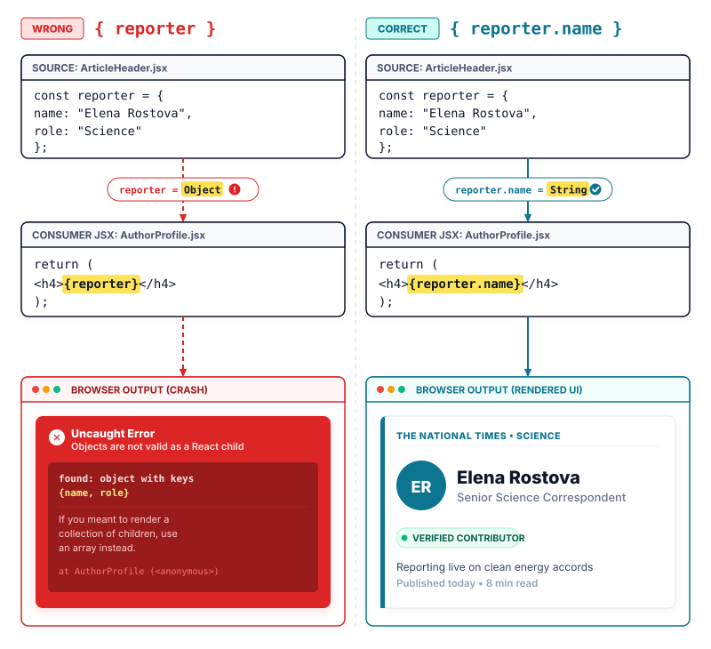

# Lecture 6: JavaScript in JSX with Curly Braces
> INTERVIEW QUESTION | ❱ CORE | How do you use JavaScript expressions inside JSX with curly braces?

1. A web developer builds the article header for the National Times website.
2. The header displays a story title and a reporter photo. That header needs current text because breaking news updates continuously.
3. The developer writes variable names directly inside the heading tag and the image source attribute.
4. The browser loads the page and prints the literal word headline on screen instead of the breaking news story.
5. Why did the page print the variable name as plain text instead of reading its value?
6. Readers see placeholder words on screen while the real story content remains locked inside the program.
7. Today you learn how markup reads your program values and brings dynamic content into the page.

### Opening a Window into JavaScript

In our previous lesson, we learned that JSX is a syntax extension that compiles directly into standard JavaScript objects (see Lecture 5). We saw how every component returns a single root element, why every tag must explicitly close, and how attributes convert to camelCase properties. But so far, our markup has been entirely static. On a news platform like The National Times, article headlines, publication dates, and reporter profiles change constantly. A component that only renders hardcoded text cannot build a living news site.

Your component file grows a fundamental new capability today: switching from static markup back into live JavaScript inside your JSX.

When beginners first try to display a JavaScript variable inside markup, they encounter a natural wall. If you create a variable named `headline` and write `<h1>headline</h1>`, the browser renders the eight letters "headline". JSX sees the text between tags as a literal string. If you try to concatenate strings using vanilla JavaScript syntax, such as `'<h1>' + headline + '</h1>'`, you break React completely because JSX elements are JavaScript objects, not strings. And if you attempt to reach into the document to run `document.querySelector('h1').textContent = headline`, you violate the foundational rule of React: components must describe their UI declaratively rather than poking at DOM nodes by hand (see Lecture 1).

To bridge this gap, React provides a dedicated mechanism: **curly braces** (a pair of curly brackets `{}` in JSX that opens a window from your markup directly into JavaScript, evaluating any valid expression and placing its result into the UI).

At its core, this entire lecture reduces to one visible change: replacing static string quotes with curly braces. Where you previously wrote `headline="Breaking Story"`, you now write `headline={storyTitle}`. Where you wrote `<h1>Breaking Story</h1>`, you now write `<h1>{storyTitle}</h1>`. That single punctuation shift transforms rigid HTML tags into a dynamic template driven by data.

> [!KEY]
> Curly braces in JSX are not a special templating tag; they are an escape hatch that allows standard JavaScript expressions to execute directly inside your markup.

When the compiler encounters curly braces inside a JSX tag or attribute, it pauses its HTML-like parsing mode. It treats whatever sits between the opening `{` and closing `}` as standard JavaScript. It evaluates that code, extracts the resulting value, and injects that value into the compiled element descriptor.

### Structuring the National Times Article Header

To see how curly braces bring a page to life, consider the article header on The National Times. Our layout consists of a top-level container component ArticleHeader.jsx, which organizes the top of the news story. Inside ArticleHeader.jsx, we assemble two distinct child components: HeadlineBanner.jsx, which displays the main story headline, the publication date, and the estimated reading time, and AuthorProfile.jsx, which displays the reporter's avatar image, name, and specialty role.

```components title="national-times — Component Explorer"
ArticleHeader.jsx | | shell
  HeadlineBanner.jsx | headline="Global Climate Summit Reaches Historic Agreement" | card | Global Climate Summit Reaches Historic Agreement;; Published Wednesday, September 9;; 8 min read (1,600 words)
  AuthorProfile.jsx | author={reporter} | profile | Elena Rostova;; Senior Science Correspondent
```

The component explorer panel above displays this hierarchy. On the left, the file tree shows ArticleHeader.jsx acting as the parent shell that hosts both HeadlineBanner.jsx and AuthorProfile.jsx. On the right, the rendered canvas reveals the final computed output: HeadlineBanner.jsx renders the headline string alongside the formatted publication date "Published Wednesday, September 9" and the reading estimate "8 min read (1,600 words)". Beside it, AuthorProfile.jsx renders the photo, the reporter's name "Elena Rostova", and her title "Senior Science Correspondent".

Every value shown in this panel is computed dynamically using curly braces. Let us examine the exact rules that govern where and how you write them.

### The Two Places Where Curly Braces Work

Inside JSX markup, curly braces can only be used in two specific locations:

1. **As text content directly between an opening and closing tag**:
```jsx title="Text Interpolation Example"
<h1>{headline}</h1> // **RIGHT:** evaluates the variable and renders its string **VALUE**
```

2. **As an attribute value placed immediately after the equal sign**:
```jsx title="Attribute Interpolation Example"
 // **RIGHT:** variable drives the attribute without string **QUOTES**
```

A common trap for newcomers is wrapping curly braces inside quotes when assigning attributes. If you write `src="{avatarUrl}"`, the curly braces lose their special meaning. JSX treats everything inside double quotes as a literal string. The browser will attempt to fetch an image from the literal address `"{avatarUrl}"` rather than the web address stored inside your variable, resulting in a broken image icon.

```jsx title="Quoted Attribute Anti-Pattern"
 // **WRONG:** quotes treat the curlies as a **LITERAL-STRING**
 // **RIGHT:** curlies without quotes pass the variable **VALUE**
```

Another boundary rule is that curly braces cannot be used to dynamically generate tag names. Writing `<{elementTag}>Content</{elementTag}>` produces an invalid syntax error. If you need dynamic element tags, you must assign the tag name or component to a capitalized variable before returning your JSX.

### Expressions versus Statements

Inside curly braces, you can write any valid **JavaScript expression** (a piece of code that evaluates to a single value, such as a variable, a calculation, or a function call).

However, you cannot write a **JavaScript statement** (a block of code that controls execution flow or declares variables, such as an if statement, a for loop, or a variable declaration).

Why does React enforce this distinction? Look at how JSX compiles. When you write `<h1>{headline}</h1>` in your component, the compiler transforms it into a call to `_jsx`:

```javascript title="Compiled Expression Call"
const element = _jsx('h1', {
  children: headline // **RIGHT:** the expression becomes a function **ARGUMENT**
});
```

In JavaScript, function arguments must be expressions. You can pass a string, a number, or the result of a calculation as a function argument. But you cannot pass a statement as a function argument: writing `_jsx('h1', { children: if (isLive) { 'Active' } })` is illegal JavaScript syntax. Because the compiler places whatever sits inside your curly braces directly into an object property, only code that evaluates to a value is allowed.

```jsx title="Expression vs Statement Syntax"
<h1>{isUrgent ? 'BREAKING NEWS' : headline}</h1> // **RIGHT:** ternary operator evaluates to a **VALUE**
<h1>{headline.toUpperCase()}</h1> // **RIGHT:** method call returns a string **RESULT**
<h1>{wordCount > 1000 && 'In-Depth Analysis'}</h1> // **RIGHT:** logical operator returns a valid **CHILD**
<h1>{if (isUrgent) { 'BREAKING' }}</h1> // **WRONG:** if statements are forbidden inside **CURLIES**
```

> [!TIP]
> **To impress the interviewer:** When asked why `if` statements cannot be used inside JSX, explain the underlying compilation transform. JSX is not an HTML template engine that parses control flow directives; it compiles down to JavaScript function calls (`_jsx`). In standard ECMAScript, function arguments must be expressions that evaluate to a value. Because statements like `if`, `for`, and `switch` perform actions rather than producing a value, they cannot be placed where an expression is expected. That is why React developers use ternary operators (`? :`), logical operators (`&&`), and array methods (`.map()`) inside JSX.

### Double Curlies: Passing Objects and Styles

A frequent point of confusion in React is the appearance of "double curlies", such as `style={{ color: 'red' }}`. New developers often wonder if `{{` represents a special React syntax feature or a template delimiter borrowed from other frameworks.

It does not. Double curlies are simply a standard JavaScript object literal nested inside a JSX curly-brace expression.

To understand why, take the code apart one step at a time. The outer pair of braces `{ ... }` tells JSX: "evaluate this JavaScript expression". Inside that expression, you want to pass an object. In JavaScript, an object literal is written with curly brackets: `{ color: 'red', fontSize: '14px' }`. When you place that object inside the JSX attribute braces, you get two sets of brackets sitting next to each other: `style={ { color: 'red' } }`. Removing the space gives you the familiar `style={{ color: 'red' }}`.

In React, the built-in `style` attribute accepts a JavaScript object rather than a CSS string. Furthermore, the property names inside that object must follow specific rules:

- **camelCase naming**: CSS properties containing hyphens must be written in camelCase because hyphens are subtraction operators in JavaScript. For example, `background-color` becomes `backgroundColor`, `border-left` becomes `borderLeft`, and `font-size` becomes `fontSize`.
- **Unitless pixel values**: Numeric values for properties like `paddingLeft`, `fontSize`, or `width` can be written as plain numbers without `'px'`. React automatically appends `px` to numerical lengths.

```jsx title="Inline Style Object Pattern"
<div
  style={{
    backgroundColor: '#f8fafc', // **RIGHT:** camelCase replaces hyphenated CSS **PROPERTY**
    borderLeft: '4px solid #0284c7', // **RIGHT:** string provides explicit border **DEFINITION**
    paddingLeft: 16 // **RIGHT:** number automatically appends pixel **UNITS**
  }}
>
  Article Content
</div>
```

### The Raw Object Pitfall

While you can pass objects to attributes like `style` or component props, you can **never** place a raw JavaScript object directly between tags as text content.

Consider this common mistake:

```jsx title="Raw Object Anti-Pattern"
const reporter = { name: 'Elena Rostova', role: 'Correspondent' };

return (
  <aside>
    <h4>{reporter}</h4> // **WRONG:** rendering a raw object crashes with a **RUNTIME-ERROR**
  </aside>
);
```

If you run this code, React crashes immediately with a famous error message: `Uncaught Error: Objects are not valid as a React child (found: object with keys {name, role}). If you meant to render a collection of children, use an array instead.`

React refuses to render raw objects because it cannot guess how you want multiple fields formatted on screen. Should it print JSON? Should it print commas? To display object data, you must always drill down to a specific primitive property, such as `{reporter.name}` or `{reporter.role}`.



### Implementing the National Times Components

With these principles established, we can implement our National Times article header components cleanly.

First, we create HeadlineBanner.jsx. This component receives the story title, the word count, and the publication date. It uses curly braces to evaluate helper functions, format dates, and calculate reading duration:

```jsx title="HeadlineBanner.jsx"
function formatPublishedDate(dateString) {
  return new Intl.DateTimeFormat('en-US', {
    weekday: 'long',
    month: 'long',
    day: 'numeric'
  }).format(new Date(dateString));
}

export default function HeadlineBanner({ headline, wordCount, publishedDate }) {
  const readMinutes = Math.ceil(wordCount / 200); // 200 words per minute reading speed
  return (
    <section className="headline-banner">
      <h1 className="banner-title">{headline}</h1> // **RIGHT:** dynamic string interpolated into **TEXT**
      <p className="banner-date">
        Published {formatPublishedDate(publishedDate)}
      </p> // **RIGHT:** function call executes inside **CURLIES**
      <span className="banner-estimate">
        {readMinutes} min read ({wordCount.toLocaleString()} words)
      </span> // **RIGHT:** math expression computes display **VALUE**
    </section>
  );
}
```

Next, we write AuthorProfile.jsx. It receives a reporter data object and demonstrates attribute interpolation, object property access, and double curlies for inline styling:

```jsx title="AuthorProfile.jsx"
export default function AuthorProfile({ author }) {
  return (
    <aside
      className="author-profile"
      style={{
        borderLeft: `4px solid ${author.theme.accentColor}`,
        paddingLeft: 16
      }} // **RIGHT:** double curlies pass an inline style **OBJECT**
    >
      
      <div className="author-details">
        <h4 className="author-name">{author.name}</h4> // **RIGHT:** property access reads string **FIELD**
        <p className="author-role">{author.role}</p> // **RIGHT:** displays role title from **OBJECT**
      </div>
    </aside>
  );
}
```

Finally, ArticleHeader.jsx ties the entire screen together. It defines the live story data and reporter configuration, rendering both child components inside a semantic header:

```jsx title="ArticleHeader.jsx"
import HeadlineBanner from './HeadlineBanner.jsx';
import AuthorProfile from './AuthorProfile.jsx';

export default function ArticleHeader() {
  const reporter = {
    name: 'Elena Rostova',
    role: 'Senior Science Correspondent',
    avatarUrl: '/images/elena-rostova.jpg',
    theme: {
      accentColor: '#0284c7'
    }
  };
  return (
    <header className="article-header">
      <HeadlineBanner
        headline="Global Climate Summit Reaches Historic Agreement"
        wordCount={1600}
        publishedDate="2026-09-09"
      /> // **RIGHT:** passes dynamic story data as **PROPS**
      <AuthorProfile author={reporter} /> // **RIGHT:** passes reporter configuration **OBJECT**
    </header>
  );
}
```

### Where you will meet this

- Publishing platform headers: formatting ISO date strings into human-readable text and computing reading duration estimates from story lengths.
- E-commerce catalog cards: injecting product image URLs into `src` attributes and formatting numeric prices with `.toFixed(2)`.
- Live notification badges: passing dynamic unread counts into pill containers and adjusting background colors with inline style objects.
- User profile dashboards: rendering dynamic initials when an avatar photo fails and binding boolean flags to `aria-hidden` attributes.

### Summary

**Expression Evaluation: Dynamic Interpolation, Attribute Binding, and Object Literals**

In daily production, you write curly braces whenever static markup connects to live application data. Curly braces are not an external templating syntax with custom loops or filtering pipes; they are standard JavaScript executing directly within your element structure. Here is your streetwise review.

❒ The Window into JavaScript

1. You use curly braces to **evaluate JavaScript expressions** inside your markup.<br>&nbsp;&nbsp;&nbsp;&nbsp;**DO THIS:** Inside tags, curly braces interpolate strings, numbers, and calculation results directly into the DOM tree.
```jsx right
<h1>{headline}</h1>
```
&nbsp;&nbsp;&nbsp;&nbsp;**DO THIS:** In attributes, curly braces assign dynamic variables directly to element properties without quotes.
```jsx right

```
2. Never wrap curly braces in **string quotes** when assigning attributes.<br>&nbsp;&nbsp;&nbsp;&nbsp;**DO THIS:** Writing `src={url}` passes the live variable value to the element property.
```jsx right

```
&nbsp;&nbsp;&nbsp;&nbsp;**DO NOT DO THIS:** Writing `src="{url}"` passes the literal string `"{url}"` instead of the variable, breaking images and links.
```jsx wrong

```

❒ Expressions versus Statements

1. You can only place **JavaScript expressions** inside curly braces, never statements.<br>&nbsp;&nbsp;&nbsp;&nbsp;**DO NOT DO THIS:** Statements like `if`, `for`, and `while` do not produce a value and crash the compiler because JSX arguments must be expressions.
```jsx wrong
<h1>{if (isUrgent) { 'BREAKING' }}</h1>
```
&nbsp;&nbsp;&nbsp;&nbsp;**DO THIS:** ALWAYS use ternary operators (`? :`), logical operators (`&&`), or function calls to handle branching logic.
```jsx right
<h1>{isUrgent ? 'BREAKING' : headline}</h1>
```
2. You can call any pure **JavaScript function** directly inside curly braces.<br>&nbsp;&nbsp;&nbsp;&nbsp;**DO THIS:** Use helper functions like `formatDate(date)` to keep presentation formatting clean and testable.
```jsx right
<p>{formatPublishedDate(publishedDate)}</p>
```
&nbsp;&nbsp;&nbsp;&nbsp;**DO THIS:** Math operations like `Math.ceil(count / 200)` execute inline and display their numerical result.
```jsx right
<span>{Math.ceil(wordCount / 200)} min read</span>
```

❒ Attributes, Objects, and Double Curlies

1. Double curlies **`{{ }}`** are not special syntax; they are a standard JavaScript object literal inside a JSX expression window.<br>&nbsp;&nbsp;&nbsp;&nbsp;**DO THIS:** The outer pair opens the JavaScript expression window for the attribute, and the inner pair declares the JavaScript object literal.
```jsx right
<aside style={{ paddingLeft: 16 }}>...</aside>
```
2. Inline styles accept an **object with camelCase properties** rather than a CSS string.<br>&nbsp;&nbsp;&nbsp;&nbsp;**DO THIS:** Write `backgroundColor` instead of `background-color` and `fontSize` instead of `font-size`. Numerical lengths like `16` automatically receive pixel units.
```jsx right
<div style={{ 
  backgroundColor: '#0284c7', 
  fontSize: 16 
}}>
  Breaking Story
</div>
```
3. NEVER place a **raw JavaScript object** directly between JSX tags as text.<br>&nbsp;&nbsp;&nbsp;&nbsp;**DO NOT DO THIS:** React throws a fatal error because it cannot choose how to serialize arbitrary object keys.
```jsx wrong
<h4>{author}</h4>
```
&nbsp;&nbsp;&nbsp;&nbsp;**DO THIS:** ALWAYS drill down to a specific primitive property like `{author.name}`.
```jsx right
<h4>{author.name}</h4>
```

➔ NEVER put quotes around curly braces if you want to pass a variable value.

➔ ALWAYS use ternary expressions instead of `if` statements inside JSX markup.

➔ IF you need to pass an inline style THEN **pass an object with camelCase properties** using double curlies.

| | **QUOTES (" ")**<br>(Static Text) | **CURLY BRACES ({ })**<br>(Dynamic Logic) |
| ---: | :--- | :--- |
| **Purpose** | Passes a literal string value | Evaluates a live JavaScript expression |
| **Attribute syntax** | `src="photo.jpg"` | `src={photoUrl}` |
| **Child content** | `<h1>Headline</h1>` | `<h1>{title}</h1>` |
| **Inline styles** | Invalid in React JSX | `style={{`<br>`color: 'red' }}` |
| **Allowed logic** | Fixed characters only | Variables, math,<br>and function calls |
| **Compiled form** | `_jsx('h1', {`<br>`children: 'Title' })` | `_jsx('h1', {`<br>`children: title })` |
