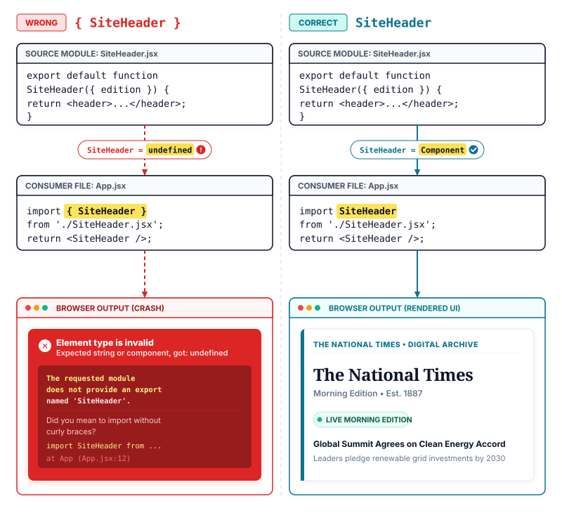

# Lecture 7: Splitting Components with Imports and Exports
> INTERVIEW QUESTION | ❱ CORE | How do you split components across files, and how do default and named imports differ?

1. A web developer builds the front page of the National Times website in a single file called `App.jsx`.
2. The page displays several distinct sections: a site header, a breaking alert badge, and a main headline story. That single file now stretches past one thousand lines of code, because every section was written in one place.
3. The developer moves the site header into a new file named `SiteHeader.jsx` and tries to load the page.
4. Why did the browser stop with a blank screen and report that the header does not exist?
5. Readers see an empty white page instead of the morning news because one file cannot see the other.
6. The two files sit next to each other on disk, but neither file knows how to share its code.
7. Today you learn how to divide your user interface across separate files and connect them without errors.

### Breaking Free from the Monolithic File

In our previous lessons, we wrote custom components, mounted them to the DOM, learned JSX syntax rules, and injected live data using curly braces (see Lecture 3 through Lecture 6). In every example so far, all of our code lived inside one file. When you first start learning React, keeping everything in a single `App.jsx` file feels convenient. But on a production news platform like The National Times, front-page layouts grow rapidly. A single file soon holds five or six components, complex styling, and hundreds of lines of markup.

Your project architecture grows a fundamental new capability today: dividing large components across separate files using JavaScript modules.

When developers first attempt to split a monolithic file, they often run into an immediate obstacle. If you cut a component function out of `App.jsx`, paste it into a new file named `SiteHeader.jsx`, and try to render `<SiteHeader />` inside `App.jsx`, the application crashes. The browser console reports `ReferenceError: SiteHeader is not defined`. Even though both files live in the exact same folder on your computer, JavaScript does not automatically share code between files.

Every JavaScript file in a modern project is an isolated **module** (a self-contained file whose variables, functions, and components remain completely private unless explicitly shared).

To share code across file boundaries, you must use two complementary mechanisms:

- **export** (a JavaScript statement that marks a component, function, or variable inside a file as publicly accessible to other files in your application).
- **import** (a JavaScript statement that loads an exported component, function, or variable from another file into the current file).

At its core, this entire lecture reduces to one visible change: placing an export statement at the exit door of the source file, and an import statement at the entrance of the file that needs it. Once you master the two ways JavaScript exports values, default exports and named exports, you can structure any application cleanly.

> [!KEY]
> Every JavaScript file is a private room; `export` unlocks the door from the inside, and `import` walks through the door from the outside.

### Structuring the National Times Front Page

To see how file splitting works in a real codebase, consider the morning front page of The National Times. Our layout consists of a top-level container component `App.jsx`, which organizes the primary page structure. Inside `App.jsx`, we assemble three distinct child components: `SiteHeader.jsx`, which renders the publication branding and edition label, `NewsBadge.jsx`, which renders live broadcast status pills, and `HeadlineStory.jsx`, which displays the leading investigative report.

```components title="national-times — Component Explorer"
App.jsx | | shell
  SiteHeader.jsx | edition="Morning Edition" | header | The National Times;; Morning Edition
  NewsBadge.jsx | status="live" | badge | LIVE UPDATE;; World News
  HeadlineStory.jsx | title="Global Summit Agrees on Clean Energy Accord" | card | Global Summit Agrees on Clean Energy Accord;; World leaders sign treaty pledging renewable grid investment by 2030.
```

The component explorer panel above displays this architecture. On the left, the file tree shows `App.jsx` acting as the root shell that imports and hosts `SiteHeader.jsx`, `NewsBadge.jsx`, and `HeadlineStory.jsx`. On the right, the rendered canvas reveals the final computed UI: `SiteHeader.jsx` renders the publication title alongside the edition badge "Morning Edition", `NewsBadge.jsx` renders status pills for "LIVE UPDATE" and "World News", and `HeadlineStory.jsx` displays the featured news card with its headline and summary text.

Let us examine how to export and import each of these components correctly.

### Default Exports: One Primary Component per File

The most common way to share a component is using a **default export** (an export declaration that designates the single primary value or component that a module exposes).

When a file exists primarily to define one component, such as `SiteHeader.jsx` or `HeadlineStory.jsx`, you export that component as the default:

```jsx title="SiteHeader.jsx"
export default function SiteHeader({ edition }) {
  return (
    <header className="site-header">
      <h1 className="brand-logo">The National Times</h1> // **RIGHT:** static brand title renders once at **PAGE-TOP**
      <p className="edition-tag">{edition}</p> // **RIGHT:** edition label injected through **PROPS**
    </header>
  );
}
```

Notice the `export default` keywords placed directly before the function declaration. This tells the JavaScript module system: "If another file asks for this module, this function is the main thing to provide."

There is one critical rule governing default exports: **a file can have at most one default export**. Attempting to write two `export default` statements in the same file will trigger a syntax error before your code even runs.

You can also declare your function first and export it at the bottom of the file with `export default SiteHeader;`. However, exporting the function inline keeps your file concise.

Always give your component function a clear name when using `export default`. While JavaScript allows anonymous default exports like `export default function() {}` or `export default () => {}`, doing so harms your developer experience. Anonymous components appear as `Unknown` or `Anonymous` inside React DevTools and browser error stack traces, making bugs much harder to track down.

### Named Exports: Sharing Multiple Components from One File

Sometimes a single file naturally contains several related components or helper utilities. For example, our `NewsBadge.jsx` file contains two distinct badge components: `LiveBadge`, which shows a blinking broadcast pill, and `CategoryBadge`, which displays the news topic.

Because a file cannot have more than one default export, how do you share both components? You use **named exports** (export declarations that export specific functions, objects, or variables bound strictly to their declared names).

To create named exports, place the `export` keyword before each function declaration without the word `default`:

```jsx title="NewsBadge.jsx"
export function LiveBadge() {
  return <span className="live-pill">LIVE UPDATE</span>; // **RIGHT:** named export shares focused status **INDICATOR**
}

export function CategoryBadge({ topic }) {
  return <span className="category-pill">{topic}</span>; // **RIGHT:** secondary named export shares category **TAG**
}
```

Unlike default exports, **a file can have as many named exports as you need**. You can export three components, four constants, and two helper functions from the same file.

Here is our featured article card, which also exports as a standard default component:

```jsx title="HeadlineStory.jsx"
export default function HeadlineStory({ title, summary }) {
  return (
    <article className="story-card">
      <h2 className="story-title">{title}</h2> // **RIGHT:** primary headline drives card **IDENTITY**
      <p className="story-snippet">{summary}</p> // **RIGHT:** descriptive summary provides context **TEXT**
    </article>
  );
}
```

### Importing Across File Boundaries

How you export a component determines the exact syntax you must use when importing it. The fundamental rule is: **default imports use no curly braces, while named imports require curly braces**.

Look at how `App.jsx` imports all three modules:

```jsx title="App.jsx"
import SiteHeader from './SiteHeader.jsx';
import HeadlineStory from './HeadlineStory.jsx';
import { LiveBadge, CategoryBadge } from './NewsBadge.jsx';

export default function App() {
  return (
    <main className="newspaper-layout">
      <SiteHeader edition="Morning Edition" />
      <div className="badge-row">
        <LiveBadge /> // **RIGHT:** renders first named import from badge **MODULE**
        <CategoryBadge topic="World News" /> // **RIGHT:** renders second named import from badge **MODULE**
      </div>
      <HeadlineStory
        title="Global Summit Agrees on Clean Energy Accord"
        summary="World leaders sign treaty pledging renewable grid investment by 2030."
      />
    </main>
  );
}
```

Notice the contrast in import lines:

1. **Default imports** (`import SiteHeader from './SiteHeader.jsx'`): Because `SiteHeader.jsx` has only one default export, you do not use curly braces. The importing file can technically choose any name for the import, such as `import Header from './SiteHeader.jsx'`, and it still receives that default function. However, keeping the import name identical to the component name avoids confusion across your team.
2. **Named imports** (`import { LiveBadge, CategoryBadge } from './NewsBadge.jsx'`): Because `NewsBadge.jsx` has multiple named exports, you must specify which values you want inside curly braces `{}`. The names inside the braces must match the exported function names exactly. You can import multiple named values in a single comma-separated list.

Understanding the file path after `from` is equally essential:

- **Relative paths** (`'./SiteHeader.jsx'` or `'../components/SiteHeader.jsx'`): The leading `./` tells the build tool to look in the current folder, and `../` looks in the parent folder.
- **Bare module specifiers** (`'react'` or `'react-dom/client'`): When a path does not start with `./` or `/`, the runtime searches inside your project's `node_modules` directory for third-party libraries. Omitting `./` when importing a local component causes the bundler to fail, complaining that the package cannot be found.

> [!TIP]
> **To impress the interviewer:** When asked to compare default versus named exports, explain their architectural trade-offs rather than just syntax. Default exports communicate a clear primary contract for a file and allow consumers to name the import freely, making them standard for route pages and root components. However, named exports provide superior refactoring safety because modern code editors can automatically rename all import sites when an export is renamed. Named exports also enforce uniform naming across large engineering teams and allow bundlers like Vite and Rollup to perform tree-shaking, dropping unused exports from the final JavaScript bundle. For this reason, many component libraries mandate named exports exclusively.

### Combining Exports and Renaming with Aliases

A single file is not restricted to choosing between default and named exports. A file can export **one default value and several named values simultaneously**.

For instance, suppose a component file exports a default `HeadlineStory` component alongside a named helper function or badge. You can import both in a single concise line:

```javascript title="Combined Import Pattern"
import HeadlineStory, { formatReadTime } from './HeadlineStory.jsx';
```

In this syntax, the identifier before the comma receives the default export, while the identifiers inside the curly braces receive the named exports.

What happens if two different files both export a component with the same name, such as `Header`? In JavaScript, you cannot declare two variables with the same name in the same scope. With named imports, you resolve collisions using the `as` keyword to create an alias.

```javascript title="Named Import Aliasing"
import { Header as SiteHeader } from './SiteHeader.jsx';
import { StoryLead as LeadStory } from './HeadlineStory.jsx';
```

The `as` keyword renames the imported component locally within the current file, preventing naming clashes while keeping both source files unchanged.

### Four Common Import Traps and How to Avoid Them

When junior developers start splitting files, four recurring errors appear in daily practice:

1. **Adding curly braces to a default import**: Writing `import { SiteHeader } from './SiteHeader.jsx'` when `SiteHeader.jsx` used `export default`. JavaScript looks for a named export called `SiteHeader`, finds nothing, and assigns `undefined`. When React tries to render `<SiteHeader />`, it throws: `Element type is invalid: expected a string or a class/function but got: undefined`.
2. **Omitting curly braces from a named import**: Writing `import LiveBadge from './NewsBadge.jsx'` when `NewsBadge.jsx` used `export function LiveBadge`. Because there is no default export, `LiveBadge` resolves to `undefined`.
3. **Forgetting the leading dot in local paths**: Writing `import SiteHeader from 'SiteHeader.jsx'` without `./`. The bundler searches `node_modules` instead of your local folder and terminates the build.
4. **Creating circular dependencies**: When `FileA.jsx` imports `FileB.jsx`, and `FileB.jsx` simultaneously imports `FileA.jsx`. Circular dependencies cause one of the files to evaluate before the other is ready, leading to silent `undefined` values during component startup. Always ensure dependencies flow downward from parent shells to child components.



### Where you will meet this

- Large publishing platforms: splitting article templates into standalone header, body, media gallery, and author card modules.
- Modern application routing: exporting page views as default exports to satisfy file-based routers in frameworks like Next.js and Remix.
- Component libraries: exporting hundreds of atomic buttons, dialogs, and form controls as named exports from a central package.
- Utility toolkits: grouping related date formatting, currency calculation, and string truncation functions into shared logic files.

### Summary

**Modular Architecture: ESM Partitioning, Default Exports, and Named Bindings**

In daily production, you organize every React application into modular files to keep codebases maintainable, testable, and scannable. Splitting code across files relies entirely on standard ECMAScript modules. Here is your streetwise review.

❒ Default Exports: The Single Component Pattern

1. Use **default exports** when a file has one primary component or responsibility.<br>&nbsp;&nbsp;&nbsp;&nbsp;**DO THIS:** Export the named function directly with `export default`.
```jsx right
export default function SiteHeader() {
  return <header>The National Times</header>;
}
```
&nbsp;&nbsp;&nbsp;&nbsp;**DO NOT DO THIS:** Do not use anonymous arrow functions as default exports because they lose their identity in debugging tools.
```jsx wrong
export default () => {
  return <header>The National Times</header>;
};
```
2. Import default exports **without curly braces**.<br>&nbsp;&nbsp;&nbsp;&nbsp;**DO THIS:** Write `import SiteHeader from './SiteHeader.jsx'` to consume the primary export.
```jsx right
import SiteHeader from './SiteHeader.jsx';
```
&nbsp;&nbsp;&nbsp;&nbsp;**DO NOT DO THIS:** Never wrap default imports in curly braces, or the imported value will be `undefined`.
```jsx wrong
import { SiteHeader } from './SiteHeader.jsx';
```

❒ Named Exports: The Multi-Item Pattern

1. Use **named exports** when a file shares multiple components or helper values.<br>&nbsp;&nbsp;&nbsp;&nbsp;**DO THIS:** Place `export` before each function declaration without the `default` keyword.
```jsx right
export function LiveBadge() {
  return <span>LIVE</span>;
}
export function TopicBadge() {
  return <span>NEWS</span>;
}
```
2. Import named exports **inside curly braces** matching the exact export name.<br>&nbsp;&nbsp;&nbsp;&nbsp;**DO THIS:** Specify exact names in curly braces, and use `as` if you need to rename them locally.
```jsx right
import { LiveBadge, TopicBadge } from './NewsBadge.jsx';
```
&nbsp;&nbsp;&nbsp;&nbsp;**DO NOT DO THIS:** Do not omit curly braces when importing named exports.
```jsx wrong
import LiveBadge from './NewsBadge.jsx';
```

❒ Path Resolution and Refactoring Rules

1. Local imports ALWAYS require a **relative path prefix** (`./` or `../`).<br>&nbsp;&nbsp;&nbsp;&nbsp;**DO THIS:** Use `./` for files in the same directory and `../` for parent directories.
```jsx right
import HeadlineStory from './HeadlineStory.jsx';
```
&nbsp;&nbsp;&nbsp;&nbsp;**DO NOT DO THIS:** Never omit `./`, or the bundler searches `node_modules` and fails.
```jsx wrong
import HeadlineStory from 'HeadlineStory.jsx';
```
2. You can combine default and named imports on **a single line**.<br>&nbsp;&nbsp;&nbsp;&nbsp;**DO THIS:** Place the default import first, followed by a comma and curly braces for named imports.
```jsx right
import HeadlineStory, {
  LiveBadge
} from './HeadlineStory.jsx';
```

➔ NEVER put curly braces around a default import.

➔ ALWAYS use named function declarations instead of anonymous arrow functions when exporting components.

➔ IF a file contains multiple components or utilities THEN **use named exports with explicit curly braces on import**.

| | **DEFAULT EXPORT**<br>(Single primary item) | **NAMED EXPORT**<br>(Multiple items) |
| ---: | :--- | :--- |
| **Declaration syntax** | `export default`<br>`function Card() {}` | `export function`<br>`Card() {}` |
| **Import syntax** | `import Card`<br>(no curly braces) | `import { Card }`<br>(with curly braces) |
| **Limit per file** | Exactly one | Unlimited |
| **Consumer naming** | Can be renamed freely<br>by importing file | Must match export<br>(or use `as` alias) |
| **Refactoring safety** | Moderate (import name<br>can drift from export) | High (IDE updates<br>all usages across files) |
| **Ideal use case** | Root app shells,<br>pages, main views | Utility components,<br>design systems, helpers |
