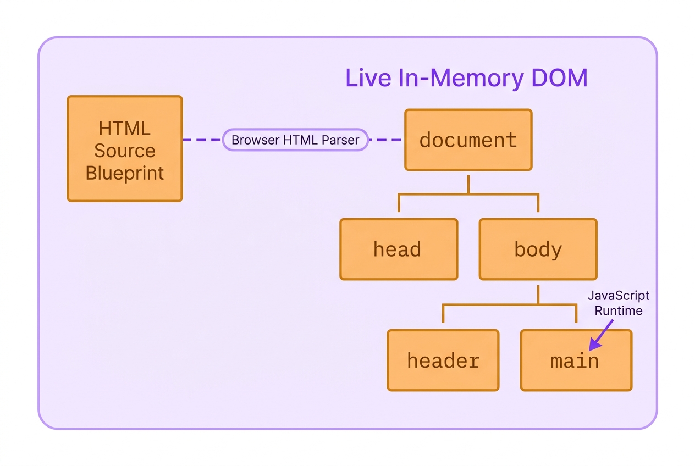
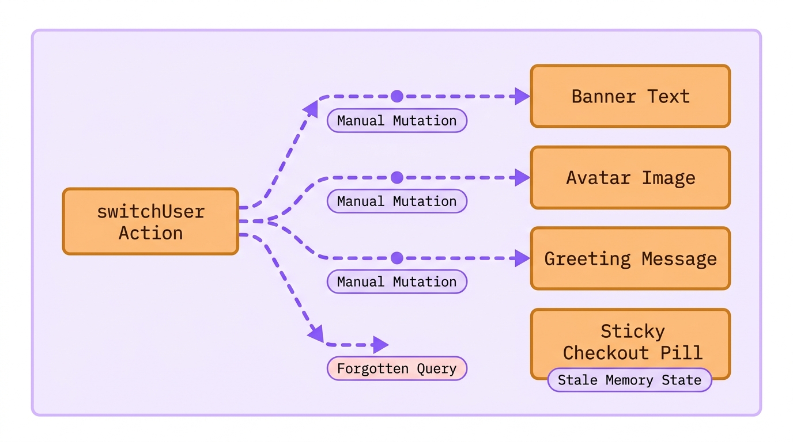
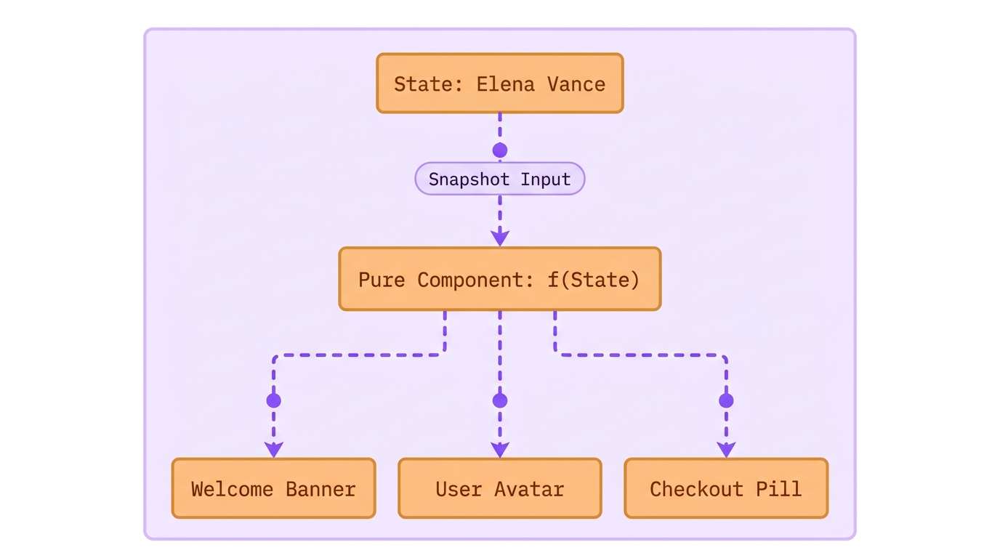
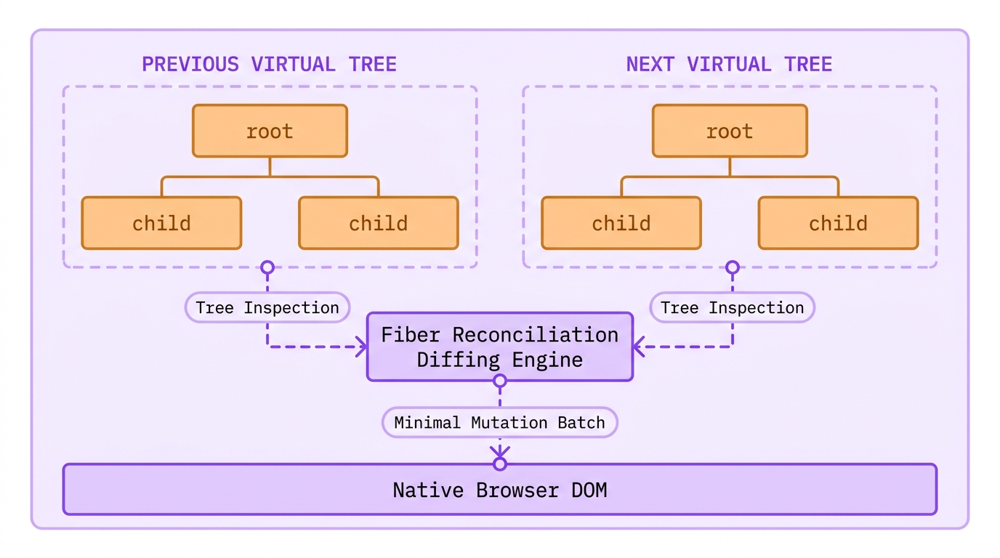
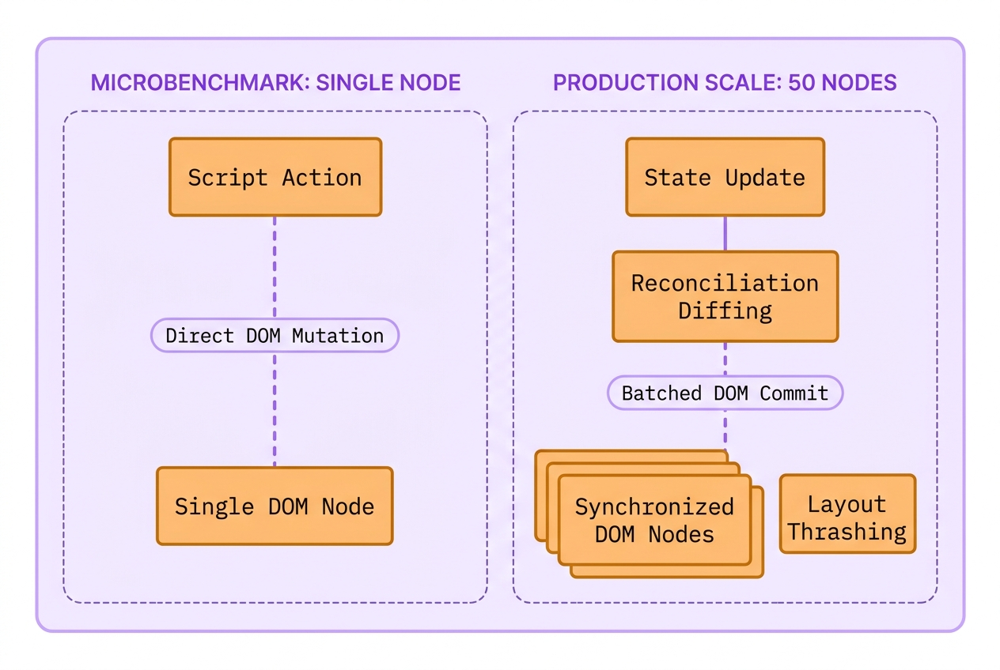

# Lecture 01: Why We Stop Hunting Elements by Hand
> INTERVIEW QUESTION | ❱ CORE | What is React, and how does its declarative, component-based model differ from plain JavaScript DOM scripting?

1. Marcus, a junior frontend engineer at The National Times, pushed a routine profile switcher to production on Friday afternoon.
2. Elena Vance, a digital subscriber, signed into her news account and saw her name appear in the top masthead.
3. When Elena switched to her family shared account, nine sections on the page updated, but the checkout pill stayed unchanged.
4. Elena renewed her annual subscription, and the billing gateway charged Marcus Vance instead of her own account.
5. Why did nine elements update correctly while the tenth element quietly kept the previous user credentials?
6. In plain JavaScript, updating the screen means finding and mutating every single matching browser node by hand.
7. Today you will uncover why imperative scripting breaks under scale, and how React guarantees that your screen never desynchronizes.

### The Scene of the Crime: Imperative DOM Scripting

You already know how to build a webpage using HTML tags. You write an `<h1>` for a headline or a `<p>` for a paragraph, save the text file, and the browser displays it. That HTML file acts as your static blueprint.

But the browser does not just display your text; it brings it to life. When the browser reads your HTML blueprint, it constructs a live, invisible model in its memory called the **Document Object Model (DOM)**. Think of your HTML as the architectural sketch, and the DOM as the actual, physical house that JavaScript can walk through, inspect, and rearrange.



> [svg image] The **Browser HTML Parser** reads the static **HTML Source Blueprint** and constructs the **Live In-Memory DOM** tree of active objects (`document`, `head`, `body`), which the **JavaScript Runtime** manipulates at runtime via Web APIs.

Here is the catch with standard web development: if you are not using a modern framework, your JavaScript has to do all the remodeling by hand.

When user data changes, such as a subscriber switching accounts, the DOM does not automatically detect the change. Instead, your JavaScript must manually climb through that live tree of elements, hunt down the exact `<p>` or `<span>` holding the old text, and physically overwrite its contents. If your application displays that subscriber name in ten different places on the screen, your script is forced to execute ten separate, tedious search-and-replace missions just to keep the interface accurate. Forgetting even one query leaves corrupted, stale data on screen.

Here is the exact vanilla JavaScript function that Marcus wrote to handle account switching on The National Times masthead:

```javascript title="vanilla-masthead.js"
function switchUser(newUser) {
  const bannerName = document.querySelector('#user-banner .name'); // **WRONG:** manual query
  bannerName.textContent = newUser.fullName;
  const avatarImage = document.querySelector('#user-avatar'); // **WRONG:** manual attribute mutation
  avatarImage.src = newUser.avatarUrl;
  const greetingText = document.querySelector('.welcome-msg'); // **WRONG:** third disconnected lookup
  greetingText.textContent = `Welcome back, ${newUser.firstName}`; // sticky checkout pill forgotten here
}
```

```html-figure src="lab/01-forensic-investigator/figures/01-01-masthead-ui-expectation.html" caption="Live browser viewport of The National Times masthead after Marcus's vanilla script runs. While the greeting, avatar, and banner update to Elena Vance, the forgotten checkout pill quietly preserves Marcus Vance."
```

When you examine the rendered viewport above, the structural flaw becomes immediately visible on screen. Marcus remembered to query `#user-banner .name`, `#user-avatar`, and `.welcome-msg`, updating the welcome greeting and avatar cleanly. But because the sticky checkout pill lived in a different file authored by another team three months earlier, he never knew it existed. The JavaScript engine ran without throwing a single error, yet the screen entered a corrupted, hybrid state where Elena was greeted by name while Marcus Vance remained active in the billing gateway.

This breakdown is not an isolated developer mistake; it is the mathematical consequence of **imperative programming**. In an imperative system, you write step-by-step instructions telling the browser *how* to change each individual element. As your product adds new features, the number of manual synchronization paths between user actions and screen elements multiplies exponentially. The official React documentation directly warns against this architectural trap:

> Manipulating the UI imperatively works well enough for isolated examples, but it gets exponentially more difficult to manage in more complex systems. Imagine updating a page full of different forms like this one. Adding a new UI element or a new interaction would require carefully checking all existing code to make sure you haven't introduced a bug (for example, forgetting to show or hide something).
*React Official Documentation (Reacting to Input with State), `documentation official/React 19 Sept 2026/react.dev/src/content/learn/reacting-to-input-with-state.md`*

To prevent this exponential complexity, modern software architecture requires abandoning manual step-by-step DOM mutations entirely.



> [svg image] In an imperative pipeline, a user action triggers independent **Manual Mutation** paths for each element. Omitting even a single target is a **Forgotten Query**, leaving that isolated element in a **Stale Memory State** while the rest of the screen drifts ahead.

### The Architectural Breakthrough: Declarative Components

Instead of telling the browser step-by-step instructions on how to mutate individual nodes, React introduces a completely different mental model known as **declarative programming**. Under this paradigm, you never write queries to hunt down existing elements. Instead, you declare what the user interface should look like for any given state, and you let the React engine handle all DOM manipulations automatically.

Think of declarative UI as a mathematical function: $\text{UI} = f(\text{State})$. Your user interface is simply the visual projection of your underlying data. When the data changes from User A to User B, React calls your function again with the new data and projects the updated result directly onto the screen.

```jsx title="Masthead.jsx"
export default function Masthead({ user }) {
  return (
    <header className="masthead">
      <div className="banner">Welcome, <strong>{user.fullName}</strong></div>
      <aside className="checkout-pill">Account: {user.fullName}</aside>
    </header>
  ); // **RIGHT:** single source of truth projects state to all elements simultaneously
}
```

```html-figure src="lab/01-forensic-investigator/figures/01-02-forensic-dom-drift.html" caption="Symmetrical State Audit comparing imperative DOM queries with declarative React. In declarative React, updating state projects changes to all bound elements simultaneously with zero drift."
```

In the component and audit above, notice that the subscriber name `user.fullName` is bound directly into both the welcome banner and the checkout pill inside the exact same function. There is no `document.querySelector`, no `textContent` assignment, and no possibility of updating one element while forgetting the other. If `user` contains Elena Vance, both elements are guaranteed to display Elena Vance simultaneously.

To fully master this paradigm, we must break down the foundational primitive of React: the **Declarative Component**.

#### 1. Technical Nomenclature & Syntax Decoding
In the code above, `function Masthead({ user })` defines a **component**. A component is a JavaScript function that accepts an input object containing data (known as **props**, short for properties) and returns a description of the user interface written in **JSX** (JavaScript XML). The curly braces `{user.fullName}` tell the React compiler to escape from markup mode into JavaScript evaluation mode, calculating the live string value during rendering.

#### 2. Tactile Physical Analogy
Think of imperative DOM scripting like an artist drawing an animated cartoon on paper with an eraser. If the character changes shirts, the artist must manually locate every single frame, erase the old shirt with rubber, and redraw the new shirt line by line. If the artist overlooks one drawing in the stack, the character flickers between red and blue shirts. By contrast, a declarative React component is like a modern digital camera taking a still photograph. You arrange your actors in the room (your state), press the shutter button, and the camera captures the entire scene in a single instant. You never redraw pixels by hand; you simply change the actors and take a fresh picture.

#### 3. The "Why We Suffered Before" Contrast
Before declarative component libraries arrived, web applications were riddled with "ghost bugs" and memory leaks. Developers had to write custom glue code connecting event listeners to DOM mutations. When a user signed out, teams had to remember to clean up old event handlers, clear cached nodes, and reset text values. In large codebases with dozens of engineers, synchronization drift was inevitable. Declarative components eliminated this entire category of bugs by turning UI into a pure, predictable derivation of data.

#### 4. The Physical Runtime Engine Routine
What does the browser actually execute when you return JSX? The browser engine does not understand JSX natively. During your project build step, a compiler transforms `<header className="masthead">` into a standard JavaScript function call: `React.createElement('header', { className: 'masthead' }, ...)`. When this function runs in memory, it returns a plain, lightweight JavaScript object describing that DOM node. React collects these objects into an in-memory blueprint and takes full responsibility for translating them into real browser DOM elements.



> [svg image] A **Pure Component** receives a **Snapshot Input** of the current application state and projects it across all bound interface elements simultaneously according to the mathematical contract $\text{UI} = f(\text{State})$.

### Under the Hood: The Virtual DOM and Fiber Reconciliation

When you first hear that React re-renders components when data changes, an intuitive alarm bell rings in every experienced engineer's mind. If rebuilding real browser DOM elements is one of the slowest operations in computer science, how can React throw away previous views and recalculate the interface on every keystroke without freezing the main browser thread?

The answer lies in React's in-memory staging area known as the **Virtual DOM**.

When you write JSX, React does not touch the real browser layout engine immediately. Manipulating native browser elements triggers layout recalculations, style re-computations, and screen repainting. If you mutate ten separate DOM nodes in sequence, the browser may recalculate geometry multiple times (an expensive performance bottleneck called **layout thrashing**).

To prevent this penalty, React performs its calculations inside memory using plain JavaScript objects. Let us inspect what your JSX actually looks like inside the engine:

```javascript title="virtual-element-snapshot.js"
const virtualHeader = {
  type: 'header',
  props: {
    className: 'masthead',
    children: [
      { type: 'div', props: { className: 'banner', children: 'Welcome, Elena Vance' } },
      { type: 'aside', props: { className: 'checkout-pill', children: 'Account: Elena Vance' } }
    ]
  }
}; // Plain JavaScript object created in microseconds with minimal memory overhead
```

Creating and comparing plain JavaScript objects takes microseconds. When Elena Vance switches accounts, React calls `Masthead({ user: elena })` in memory, generating a brand new virtual element tree.

Once the new virtual tree is constructed, React compares the newly returned virtual tree against the tree from the previous render to isolate the exact properties and text nodes that changed (a comparison routine known as **reconciliation**). React pinpoints that only the text nodes inside the banner and the aside changed, while the outer `<header>` container remained completely untouched. 

Only after this comparison is finished does React enter its commit phase, applying the absolute minimum number of mutations directly to the real browser DOM in one fast batch.



> [svg image] The **Fiber Reconciliation Diffing Engine** executes a **Tree Inspection** comparing the previous virtual tree against the next virtual tree in memory, calculating the **Minimal Mutation Batch** before writing to the **Native Browser DOM**.

**DO NOT DO THIS:** Imperative DOM updates scatter state across disconnected handlers
```javascript wrong
function handleLogin(user) {
  document.getElementById('header-user').innerText = user.name;
  document.getElementById('sidebar-user').innerText = user.name;
  document.getElementById('footer-user').innerText = user.name;
}
```

**DO THIS:** Declare UI as a direct projection of props in a single component tree
```jsx right
export function UserBadge({ user }) {
  return (
    <div className="user-badge">
      <span className="name">{user.name}</span>
      <span className="role">{user.role}</span>
    </div>
  );
}
```

> [!WISDOM]
> **Why we embrace component boundaries:** Beginners often wonder why React forces you to split code into small components rather than writing one giant HTML template. The reason is isolation of concern. When a component re-renders, React only evaluates that specific component function and its children. Isolating state into self-contained components ensures that data changes only trigger re-evaluations where they are strictly needed.

### The Senior Interview Masterclass: Busting the Speed Myth

In senior technical interviews, interviewers frequently test whether a candidate truly understands React's engine architecture or merely repeats marketing slogans from tutorials. One of the most common elimination questions sounds deceptively simple:

> *"If direct DOM manipulation takes 0.01 milliseconds and React takes 0.2 milliseconds to allocate virtual objects and diff them, why did the entire industry switch to React? Is React faster than the DOM?"*

If a candidate answers, *"React is faster than the DOM because the Virtual DOM is fast,"* the interview is effectively over. The interviewer knows the candidate does not understand the browser engine.

Direct, hand-tuned DOM scripting is **always faster** than React in raw microbenchmarks. When you write `document.getElementById('total').textContent = '$50'`, the JavaScript engine directly mutates a single property on an existing C++ object in the browser core. React, by contrast, must execute component functions, instantiate virtual element objects, traverse the Fiber tree, run diffing algorithms, and then execute that exact same C++ DOM property mutation anyway. React does strictly more computational work than a single manual DOM update.

Why, then, did the entire software industry adopt React?

The reason is that **human software engineering teams do not write optimal manual DOM code at enterprise scale**.

In a production application with hundreds of thousands of lines of code, dozens of asynchronous network requests, web sockets, modals, and real-time feeds, human developers cannot track every possible state combination by hand. To make vanilla JavaScript as fast as React in production, you would have to write your own custom diffing layer, track previous state in memory, batch your DOM writes, and avoid layout thrashing across fifty engineers. You would essentially spend five years building a buggy, half-finished version of React.

React provides **predictable, deterministic performance by default**. It may not be faster than the theoretical ceiling of hand-crafted assembly-level DOM code, but it is infinitely faster than the slow, layout-thrashing, memory-leaking code that humans actually write under real-world deadlines.



> [svg image] In production, React's **Reconciliation** diffing calculates the precise changes across the component tree, executing a single **Batched DOM Commit** to shield the browser from **Layout Thrashing** and redundant reflows.

> [!TIP]
> **To impress the interviewer:** When asked to compare declarative React to imperative DOM scripting, frame your answer around **cognitive bandwidth and synchronization invariants**. State clearly: *"Direct DOM scripting is faster in microbenchmarks because it skips abstraction overhead. However, React provides architectural scaling. By treating the UI as a pure projection of state ($UI = f(State)$), React shifts the burden of synchronization from developer memory to an automated reconciliation engine. This eliminates state drift, guarantees UI consistency, and prevents layout thrashing across large engineering teams."*

### Where you will meet this

1. **User Authentication & Session Switches:** Updating profile mastheads, permission badges, and avatar menus simultaneously across deep application layouts.
2. **E-Commerce Shopping Carts:** Synchronizing item counts, subtotal badges, slide-out drawer tallies, and floating checkout pills from a single cart state.
3. **Real-Time Dashboards:** Reflecting streaming financial ticker updates or notification counters across multiple widgets without DOM selector spaghetti.
4. **Complex Multi-Step Forms:** Conditionally showing, hiding, and validating dependent input fields based on previous answers without manual class toggles.

### Glossary

- **Declarative UI**: A programming paradigm where you describe what the screen should look like for a given state, leaving the step-by-step browser DOM operations to the underlying engine.
- **Imperative UI**: A programming model where you write explicit instructions commanding the browser how to locate, create, mutate, and remove individual DOM elements.
- **Component**: A reusable, self-contained JavaScript function that accepts inputs (props) and returns a description of a user interface written in JSX.
- **Virtual DOM**: A lightweight, in-memory tree of plain JavaScript objects representing the desired structure of the real browser DOM.
- **Reconciliation**: The internal comparison process where React diffs the newly returned virtual element tree against the previous tree to compute the minimal set of real DOM updates.
- **Layout Thrashing**: A performance catastrophe caused by alternating between reading and writing DOM properties, forcing the browser layout engine to repeatedly recalculate page geometry.

### Summary

**The Declarative Mental Model**

The transition from imperative DOM scripting to declarative React represents a permanent shift from manual mutation to mathematical projection. Understanding this foundation is what separates engineers who copy syntax from architects who design resilient systems.

❒ The Imperative Scaling Collapse
1. Manual DOM queries create tight coupling between JavaScript logic and HTML selectors:
<br>&nbsp;&nbsp;&nbsp;&nbsp;(a) Renaming a class or ID in markup silently breaks disconnected JavaScript handlers.
<br>&nbsp;&nbsp;&nbsp;&nbsp;(b) Adding a new UI element requires auditing all existing event handlers to ensure the new node receives updates.
<br>&nbsp;&nbsp;&nbsp;&nbsp;(c) As state interactions multiply, synchronization drift is mathematically guaranteed.
2. Principles to remember:
➔ NEVER query the browser DOM directly inside a React component using `querySelector` or `getElementById`.
➔ ALWAYS treat your user interface as a pure visual projection of underlying state data.

❒ The Declarative Guarantee
1. React unifies state and presentation into an automated synchronization loop:
<br>&nbsp;&nbsp;&nbsp;&nbsp;(a) You define the complete visual structure of your component in JSX for any given prop input.
<br>&nbsp;&nbsp;&nbsp;&nbsp;(b) When data changes, React evaluates the component function to construct a fresh virtual element tree.
<br>&nbsp;&nbsp;&nbsp;&nbsp;(c) The reconciliation engine computes the minimal diff and flushes changes to the real DOM in a single optimized batch.
2. Operational rule:
➔ IF a piece of data affects what the user sees, THEN place that data in state or props so React can track its updates automatically.

**DO NOT DO THIS:** Query DOM elements across disparate event handlers to imperatively patch text and classes by hand.
```javascript wrong
function updateSubscriber(name, tier) {
  document.querySelector('.badge').className = `badge ${tier}`;
  document.querySelector('.name').textContent = name;
  document.querySelector('.tier').textContent = tier;
}
```

**DO THIS:** Declare your complete UI structure in JSX and let React synchronize the DOM nodes automatically from state.
```jsx right
function SubscriberBadge({ name, tier }) {
  return (
    <aside className={`badge ${tier}`}>
      <span className="name">{name}</span>
      <span className="tier">{tier}</span>
    </aside>
  );
}
```

| | **Imperative DOM Scripting**<br>(Plain JavaScript) | **Declarative Component Model**<br>(React 19) |
| ---: | :--- | :--- |
| **Mental Model** | Step-by-step mutation commands telling the browser *how* to change elements | High-level data declaration describing *what* the interface should look like |
| **DOM Synchronization** | Manual developer responsibility via queries (`querySelector`, `getElementById`) | Automated engine responsibility via virtual tree diffing and reconciliation |
| **Scaling Complexity** | Exponential defect surface ($O(N)$ manual sync paths as features expand) | Constant synchronization guarantee ($UI = f(State)$ regardless of tree size) |
| **Raw Microbenchmark Speed** | Marginally faster in single-node updates due to zero abstraction overhead | Adds small memory and diffing overhead to guarantee cross-app consistency |
| **Failure Mode** | Silent desynchronization (some elements update while others display stale state) | Deterministic rendering (entire component tree renders the latest data snapshot) |
