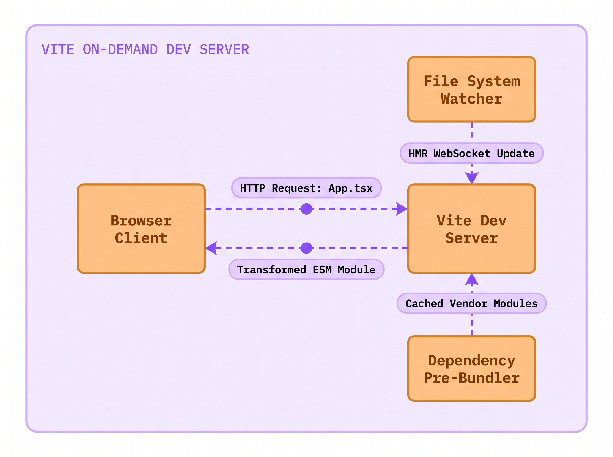
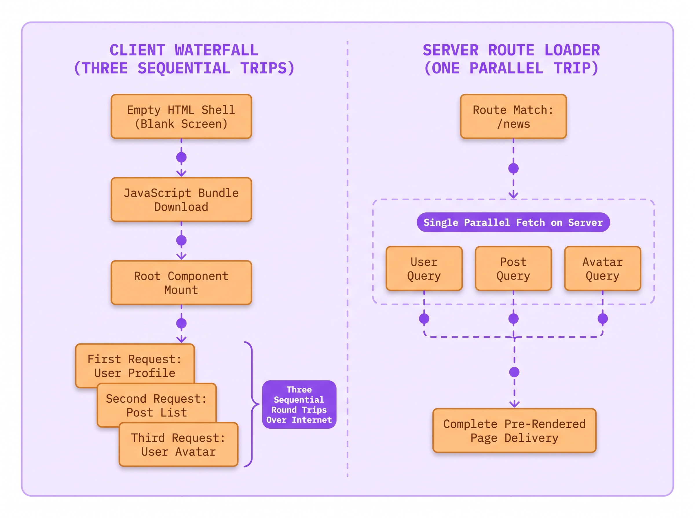
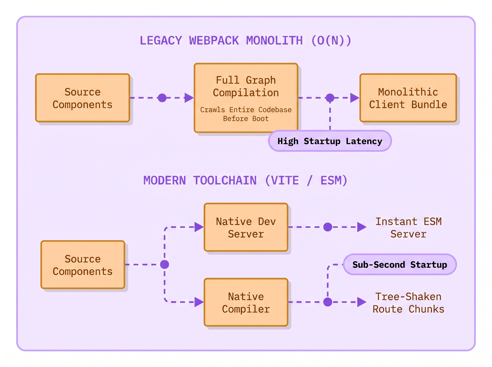
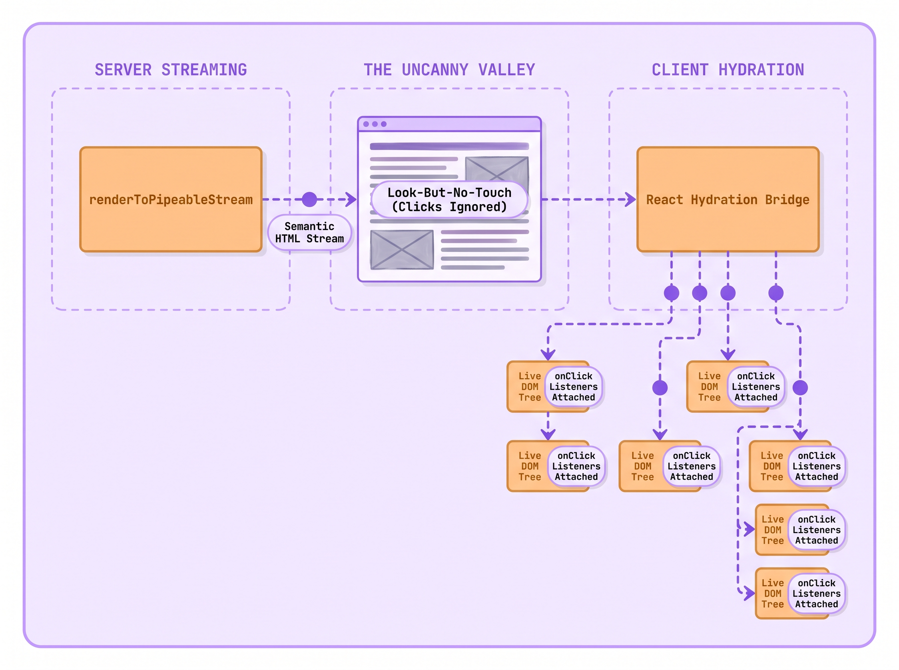
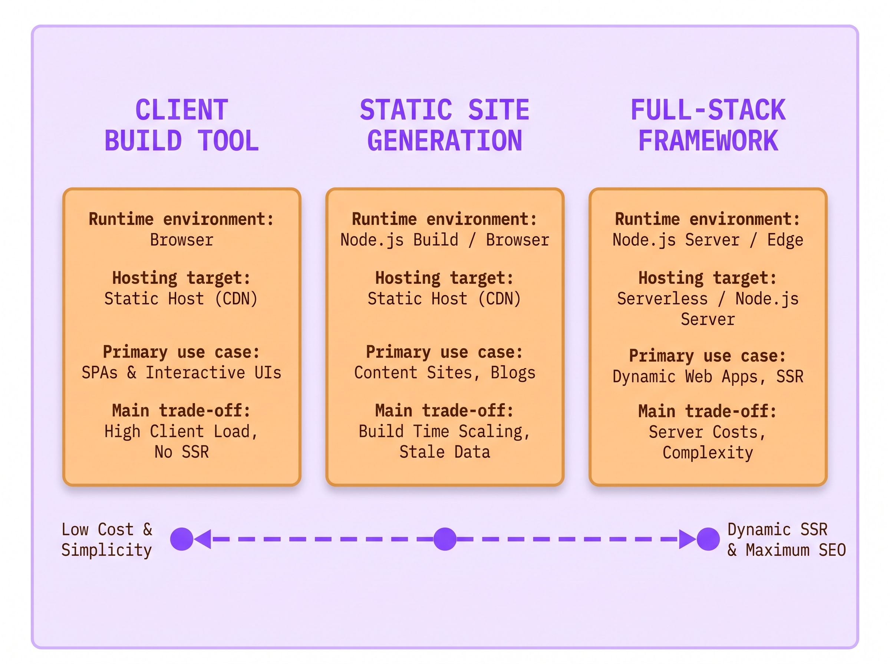

# Lecture 02: How We Start a Project Without the Bloat
> INTERVIEW QUESTION | ❱ CORE | How do you create and run a new React project, and how do you choose between a framework and a build tool?

1. Julian Torres, an associate developer at The National Times, prepared the Election Night live results desk on Tuesday afternoon.
2. Digital editor Elena Vance warned him that three hundred thousand readers would load the live election results on mobile phones.
3. Julian spun up a client-only single-page application using an old tutorial, deploying a blank root div to production.
4. When voting closed, mobile readers on cellular networks stared at a blank white screen for over four seconds.
5. Why did the live page take four seconds to paint text when the underlying JSON payload was only twelve kilobytes?
6. In a bare client application, the browser cannot fetch data until it downloads, parses, and executes the entire JavaScript bundle.
7. Today you will uncover how modern bundlers build React projects, and how to choose the right foundation without bloat.

### The Crime Scene: Two Extremes on Election Night

You already know how to write a React component. You define a function, return JSX markup, and expect React to project that structure into the browser DOM.

When developers prepare to launch a new application, they face an immediate fork in the road: what command do you run in your terminal to create the project? For years, online tutorials told everyone to run `npx create-react-app`, which is now officially deprecated. The React team divides modern frontend setup into two clear paths: **Client-Side Build Tools** and **Full-Stack Frameworks**. Your choice depends on where your HTML is created.

A **Client-Side Build Tool** (such as **Vite**) builds applications that run entirely inside the user's browser. This architecture is called **Client-Side Rendering (CSR)**. The web server sends an empty HTML shell with a `<script>` tag. The user's browser downloads the JavaScript bundle and builds the entire interface locally. Client-side tools are fast to develop and cheap to host. They are ideal for private dashboards, internal tools, and interactive widgets.

A **Full-Stack Framework** (such as **Next.js** or **React Router v7**) solves the blank-screen problem by pre-rendering your components into complete, readable HTML before sending them over the network. Frameworks deliver HTML using two primary strategies:
1. **Static Site Generation (SSG)**: You run a build command ahead of time. It generates finished HTML files that sit on a global CDN and load in milliseconds.
2. **Server-Side Rendering (SSR)**: When a user visits a URL, a server runs your React components on demand. It injects live data into the markup and sends back complete HTML. The user sees headlines and articles immediately without waiting for client JavaScript to run.

Here is the tension that traps engineering teams: developers either choose too little tooling or too much tooling.

Julian wanted to keep things simple on election night. He avoided frameworks and built a bare, client-only single-page application. When mobile readers clicked breaking news alerts, their phone downloaded an empty `<div id="root"></div>`. The phone could not display a single vote count yet. It had to download a heavy 1.6 megabyte JavaScript bundle first. Then the browser parsed the code and mounted React. Only then did the app start fetching election data over the cellular network. Readers stared at a blank white screen for four seconds and gave up.

Meanwhile, another engineering team at The National Times built an internal schedule tool for three staff editors. To follow modern trends, they set up a heavy Node.js server with streaming server rendering. The three editors only needed a simple private dashboard behind a company login. Instead, the team spent weeks fixing Docker containers, chasing memory leaks, and paying high cloud bills for servers that sat idle all day.

Both teams failed because neither understood the fundamental trade-offs of modern project setup.



> [svg image] In development, the **Native ES Module Dev Server** serves source files over HTTP on demand with a **Dependency Pre-Bundler** supplying cached vendor modules, allowing the **Browser Client** to import modules directly and receive targeted **Hot Module Replacement** updates via a **File System Watcher**.

Here is the minimal command that modern engineers run when creating a client-only React application from scratch:

```bash title="terminal"
npm create vite@latest election-desk -- --template react-ts // **RIGHT:** instant start using native ES modules
```

```html-figure src="lab/01-forensic-investigator/figures/02-01-vite-project-explorer.html" caption="React Component Explorer showing the unbloated project tree of a fresh Vite and React 19 scaffold. The live stage displays the canonical App.tsx starter template mounted into the root container with sub-millisecond local compilation."
```

A fresh Vite project contains zero configuration bloat. It provides only the essential files: an `index.html` file at the project root, a minimal `vite.config.ts`, a `package.json`, and the starter source files inside `src/` (`main.tsx`, `App.tsx`, and `App.css`). There are no thousand-line Webpack configuration files, no hidden scripts, and no server runtimes. This lightweight structure represents the first half of your architectural decision: the **client-side build tool**.

### The Modern Build Tool: Instant Start with Vite

When you start your local development server, older bundlers and modern build tools take completely different paths. In older setups, your build tool had to read every file in your project first. It compiled your JSX, resolved imports, and built one giant bundle before the dev server could even boot. If your project had five hundred components, you waited thirty seconds every morning just to see your home page. Editing a single CSS rule forced you to wait through another slow build cycle.

A modern build tool like **Vite** permanently eliminates this startup delay by dividing the development workflow into two distinct categories: **dependencies** and **source code**.

First, dependencies (like `react` and `react-dom`) are pre-bundled using **esbuild**. Esbuild is written in the Go language and runs up to one hundred times faster than JavaScript bundlers. Second, your application source code is never bundled during development at all. Instead, Vite serves your files directly over HTTP using the browser native **ES Modules (ESM)** standard.

When you open your browser to `http://localhost:5173`, the browser requests `index.html`. When the browser engine encounters `<script type="module" src="/src/main.tsx">`, it reads the file and sees `import LiveDesk from './LiveDesk'`. Instead of waiting for a massive bundle, the browser sends an HTTP request asking the Vite server specifically for `LiveDesk.tsx`. Vite transforms only that single file on the fly and returns it in microseconds.

Here is the exact component that Julian should have mounted to display the election results cleanly without server baggage:

```tsx title="LiveDesk.tsx"
export default function LiveDesk({ status, percent }) {
  return (
    <div className="live-desk">
      <header className="desk-header">
        <span className="live-pill">{status}</span>
        <h2>Metro Transit Vote: Live Results Update</h2>
      </header>
      <div className="metric-row">
        <span>Counted: {percent}%</span>
      </div>
    </div>
  ); // **RIGHT:** lightweight component mounted without server runtime overhead
}
```

The `LiveDesk` component accepts two props: `status` and `percent`. When you edit the headline text in your editor, Vite detects the save immediately using your operating system file watcher. Instead of rebuilding the whole app, Vite sends only the changed file over a local WebSocket connection (a feature known as **Hot Module Replacement** or **HMR**). The updated component swaps into the running page in twelve milliseconds without reloading the browser or losing your current screen state.

The tool is named **Vite**, from the French word for fast (pronounced *veet*). When you run `npm create vite@latest`, npm starts an interactive setup prompt that downloads a clean template. The flag `--template react-ts` configures TypeScript support alongside React 19 JSX compilation plugins out of the box. Running `npm run dev` starts the instant local development server, while `npm run build` compiles minified static assets for deployment.

Think of older monolithic bundlers like a print shop that insists on binding an entire hardbound encyclopedia before letting you read a single sentence. If you spot a typo on page four, the printer tears apart the binding, re-prints every volume, and re-binds the entire encyclopedia from scratch. By contrast, a native ES module dev server is like an automated digital index card dispenser. When you sit at your desk, the dispenser hands you only the single card you requested. If you correct a word on that card, the dispenser swaps that single card in your hand without disturbing the rest of the deck.

Why did developers suffer before modern build tools? In 2016, setting up a React project required hand-configuring Babel, Webpack, ESLint, and dev servers. The React team introduced **Create React App (CRA)** to unify these tools into a single package (`react-scripts`). CRA was a triumph that onboarded an entire generation of frontend engineers. But over time, CRA became a frozen monolith. Its underlying Webpack configuration grew slow, builds became sluggish, and it had no mechanism to support modern React features like streaming server rendering, React Server Components, or route-level data prefetching. On February 14, 2025, the React team officially sunsetted Create React App.

The official deprecation notice directly addresses why the React ecosystem moved away from CRA:

> Although Create React App makes it easy to get started, there are several limitations that make it difficult to build high performant production apps... Since Create React App currently has no active maintainers, and there are many existing frameworks that solve these problems already, we have decided to deprecate Create React App.
*React Official Documentation (Sunsetting Create React App), `documentation official/React 19 Sept 2026/react.dev/src/content/blog/2025/02/14/sunsetting-create-react-app.md`*

When you run `npm run build`, Vite switches from development mode to an optimized production build. It parses your TypeScript and JSX, removes unused code (an optimization known as **tree shaking**), and splits your app into small, hashed files inside a `dist/` folder. You can upload this `dist/` folder to any static host, such as Cloudflare Pages, GitHub Pages, or an AWS S3 bucket, with zero servers to manage.

### The Hidden Iceberg: Why Client-Only SPAs Hit a Wall

Vite provides instant server startup, rapid hot reloading, and zero server maintenance. Yet the official React documentation explicitly recommends starting new projects with a framework. Election night at The National Times exposed the physical limitation that triggered this recommendation.

When you deploy a pure client-side single-page application, you ship an architectural limitation: your server only delivers a blank HTML skeleton. When a reader requests `https://nationaltimes.com/election-live`, the web server returns the following static HTML document:

```html title="index.html"
<!DOCTYPE html>
<html lang="en">
  <head>
    <meta charset="UTF-8" />
    <title>The National Times</title>
  </head>
  <body>
    <div id="root"></div> <!-- **WRONG:** empty container forces client to download JS before painting any content -->
    <script type="module" src="/src/main.tsx"></script>
  </body>
</html>
```

```html-figure src="lab/01-forensic-investigator/figures/02-02-framework-vs-buildtool-audit.html" caption="Symmetrical State Audit comparing a client-only Vite SPA against a full-stack framework under mobile network conditions. The client-only app triggers an empty initial HTML payload, sequential waterfalls, and a 3.8-second delay before the first paint."
```

The performance audit exposes the structural flaw of client-only rendering. When a reader on a mobile phone clicks an election link, the browser cannot display anything meaningful right away because the initial HTML contains no articles, no headlines, and no live results.

The browser gets stuck in a slow, six-step relay race before the user sees anything:
1. **Download HTML:** The browser fetches the empty HTML file.
2. **Download JavaScript:** The browser finds the `<script>` tag and downloads the large JavaScript bundle.
3. **Parse code:** The browser engine reads, parses, and compiles all that JavaScript.
4. **Mount React:** React runs `createRoot` and builds the component tree in memory.
5. **Fetch data:** Your component finally mounts and triggers a `fetch` call or `useEffect`.
6. **Wait for network:** The request travels across the network to the API server and returns the live numbers.

Only after step six finishes can React paint candidate names and vote counts on the screen. If a reader is on a slow cellular connection, each step adds a delay. That is why readers stared at a blank screen for four painful seconds.

This chain delay is called a **network request waterfall**. If child components also fetch their own separate data after mounting, the waterfall cascades even deeper: parent mounts, parent fetches, child mounts, child fetches. On high-latency mobile networks, each round trip adds hundreds of milliseconds, resulting in a frustrating white screen.

Search engine crawlers and social media preview bots also suffer. When someone shares your article on social media, the crawler fetches only the raw HTML text. It does not run heavy JavaScript bundles. Because your HTML contains only an empty `<div id="root"></div>`, the bot sees zero text. Your shared link appears as a broken, blank preview card without headlines or images.



> [svg image] A **Client-Side Single-Page Application** downloads an empty HTML shell and makes chained API requests one after another, forcing the user to wait for three separate round trips over the internet while nested spinners flicker on screen. In contrast, a **Full-Stack Route Loader** fetches all three data sets in parallel on the server in a single trip before sending completed HTML.

This breakdown exposes the **Ad-Hoc Framework Trap**.

When teams start with a bare build tool and hit these walls, they try to fix each problem by hand. They write custom routers and loading spinners. Then they add custom data fetchers and caching code. Within a year, the team has accidentally built its own buggy, unmaintained framework.

The official React documentation directly warns against this trap:

> Starting from scratch is an easy way to get started using React, but a major tradeoff to be aware of is that going this route is often the same as building your own adhoc framework. As your requirements evolve, you may need to solve more framework-like problems that our recommended frameworks already have well developed and supported solutions for.
*React Official Documentation (Build a React App from Scratch), `documentation official/React 19 Sept 2026/react.dev/src/content/learn/build-a-react-app-from-scratch.md`*

Instead of reinventing the wheel, production teams adopt frameworks that include routing, pre-rendering, and data loading out of the box.

### The Full-Stack Spectrum: Frameworks Without Server Bloat

When developers hear the phrase "full-stack framework", an immediate objection surfaces: *"I do not want to manage a Node.js server! I just want to host static files on a global content delivery network."*

This objection comes from an old misunderstanding. In modern React, **a full-stack framework does not force you to run a backend server**.

Every major React framework, including **Next.js** and **React Router v7**, gives you four clear ways to deliver HTML to your users:
1. **Client-Side Rendering (CSR)**: The server sends a nearly blank HTML file. The user's phone downloads the JavaScript bundle and builds the entire screen locally.
2. **Static Site Generation (SSG)**: You run a build command ahead of time. It generates finished HTML files for every page. These static files live on a global CDN and load in milliseconds without any server compute.
3. **Server-Side Rendering (SSR)**: When a user visits a URL, a server runs your components on demand, injects fresh data, and sends back complete HTML. The user sees headlines and live results immediately, without waiting for client JavaScript to run.
4. **React Server Components (RSC)**: Components that stay entirely on your server. They query databases directly and stream rendered UI to the browser without adding extra JavaScript weight to the user's download.

You can build your app with nested pages and fast data loading. Then you run one export command. The framework creates plain HTML and JavaScript files ready for any CDN. You upload them to Cloudflare Pages or an AWS S3 bucket. You get fast initial paints and full search indexing with zero monthly server bills.

The official React documentation highlights this flexibility:

> All the frameworks on this page support client-side rendering (CSR), single-page apps (SPA), and static-site generation (SSG). These apps can be deployed to a CDN or static hosting service without a server. Additionally, these frameworks allow you to add server-side rendering on a per-route basis, when it makes sense for your use case.
*React Official Documentation (Creating a React App), `documentation official/React 19 Sept 2026/react.dev/src/content/learn/creating-a-react-app.md`*



> [svg image] Legacy Create React App required a monolithic **Webpack Full-Bundle Compilation** cycle crawling the entire dependency graph into a single bundle, whereas modern toolchains split work between a **Native Dev Server** for instant ESM delivery and a **Native Compiler** producing optimized **Tree-Shaken Route Chunks**.

Here is how modern framework route loaders solve the network waterfall problem. In a framework like React Router v7, data loading lives alongside the route definition rather than hidden inside a component hook:

```tsx title="routes/live-desk.tsx"
export async function loader() {
  const [results, status] = await Promise.all([
    fetch('/api/election/results').then(r => r.json()),
    fetch('/api/election/status').then(r => r.json())
  ]); // **RIGHT:** parallel data fetch initiated before component rendering starts
  return { results, status };
}
```

The standalone `loader` function runs before any component mounts. When a reader clicks a link to the live desk, the framework starts both network requests immediately in parallel (`Promise.all`). This eliminates the sequential waterfall completely.

When the server or build script renders this route, it outputs complete, semantic HTML. When the reader's browser downloads the document, headlines and live results paint on screen in under four hundred milliseconds.

Once the HTML is on screen, the browser downloads a small JavaScript file. React reads this script and connects it to the HTML already visible on the page. It attaches click listeners and internal state so buttons become active (a process known as **hydration**). Because the HTML was already visible, the user never sees a white flash or shifting buttons.



> [svg image] During page delivery, the server sends pre-rendered **Semantic HTML Markup** for immediate visual paint through **renderToPipeableStream**, followed by the client bundle executing **Hydration** to attach active **onClick** event listeners to existing DOM nodes across the **Uncanny Valley** latency gap.

### Under the Hood: The Modern Scaffolding Decision Matrix

Choosing between a build tool and a full-stack framework depends on concrete engineering requirements rather than social media trends. When evaluating a new project, assess your architecture against four practical questions:
1. **Pages and URLs:** Does your app have multiple screens and nested routes?
2. **Data Fetching:** Does your data need to load in parallel before the screen paints?
3. **Search and Social:** Do search engines and social media bots need to read your content?
4. **Server Budget:** Can you deploy static files to a CDN, or do you have a server runtime?



> [svg image] The **Modern React Architecture Spectrum** spans from a client-only **Build Tool** deploying static bundles to an edge storage bucket, to **Static Site Generation** for pre-rendered edge caching, to a **Full-Stack Framework** providing **Server-Side Rendering** and dynamic streaming without client waterfalls.

Here are the four standard commands you should keep in your engineering toolkit, categorized by project scope:

**DO NOT DO THIS:** Start a new project using deprecated, unmaintained tooling packages
```bash wrong
npx create-react-app my-app // Deprecated since February 2025; slow builds and no React 19 feature support
```

**DO THIS:** Start a client-only application or standalone widget with Vite
```bash right
npm create vite@latest my-app -- --template react-ts // Instant ESM dev server, perfect for dashboards and SPAs
```

**DO THIS:** Start a public-facing web application with a full-stack framework
```bash right
npx create-react-router@latest my-app // Production-grade routing, parallel data loaders, and static export options
```

**DO THIS:** Start a universal cross-platform mobile application with Expo
```bash right
npx create-expo-app@latest my-app // Universal React Native applications for iOS, Android, and web
```

> [!WISDOM]
> **A framework does not mean a server:** Beginners assume choosing a framework forces them to run a heavy Node.js server. That is not true. A framework provides structure: nested routing, code splitting, asset handling, and pre-rendering. You can use a framework purely to generate static HTML and JavaScript files. Choosing a framework gives your app room to grow without forcing you to manage server hardware.

During team planning, evaluate your architecture against these clear requirements:

1. **Choose a Client Build Tool (Vite / Rsbuild) if:**
   - You are building an internal tool or private dashboard behind a login screen where search engines never look.
   - You are building a standalone widget (like a calculator or audio player) embedded inside an existing website.
   - You are building an offline-first app where all data stays locally in the browser.
   - Your backend is already an independent REST or GraphQL API built by a separate team.

2. **Choose a Full-Stack Framework (React Router v7 / Next.js) if:**
   - Your site is public-facing and depends on search engine rankings, social preview cards, and fast mobile loading.
   - Your app has multiple pages with nested layouts, tabbed navigation, and browser history.
   - You want to fetch data in parallel before components mount, avoiding blank screens and spinners.
   - You plan to use React 19 Server Components to fetch data directly without writing boilerplate API routes.

### The Senior Interview Masterclass: Defending Your Architecture

In staff and senior frontend engineering interviews, interviewers frequently probe your understanding of project setup with questions designed to catch dogmatic developers:

> *"The official React docs say we should always start with a framework. If an engineer on your team proposes using Vite for our next project, would you reject their proposal? Why or why not?"*

If a candidate answers, *"Yes, I would reject it because the React team says frameworks are always better,"* the interviewer marks the candidate down as an echo-chamber junior who follows authority without understanding technical trade-offs.

A senior engineer evaluates the cost of every architectural choice. Full-stack frameworks add rigid conventions: strict folder naming, specialized file structures (like `page.tsx`), and proprietary routing systems. If your project is a five-component widget embedded inside an existing Rails or Django application, adding a full framework introduces unnecessary complexity.

Similarly, setting up server rendering for a private internal tool behind corporate login wastes engineering effort. Search crawlers cannot access private tools, and internal users do not need social share previews. A lean Vite single-page application deployed to a static storage bucket starts in milliseconds, costs pennies, and eliminates server maintenance entirely.

> [!TIP]
> **To impress the interviewer:** Frame your answer around **business goals, team maintenance, and real application needs**. Say: *"I would not reject Vite outright. The official advice to use a framework exists to stop teams from building their own buggy frameworks when creating public web applications that need search ranking and fast mobile loading. But for internal tools, embedded widgets, or canvas games, Vite is an ideal choice. It offers instant startup, zero server costs, and total freedom. I pick the tool based on whether the project needs public search discovery and pre-rendered HTML, or whether it works best as a fast, private client app."*

### Where you will meet this

1. **Interactive News Graphics:** Building charts, calculators, or maps embedded into articles using a small Vite script.
2. **Company Internal Tools:** Building staff directories and admin consoles behind a company login.
3. **Public Media Websites:** Launching newspaper front pages, online stores, and blogs that need fast mobile loading and social sharing.
4. **Cross-Platform Mobile Apps:** Building universal mobile and web apps using Expo and React Native with shared code.

### Glossary

- **Build Tool**: A local tool (like Vite) that runs a fast development server and bundles your code into static files for production.
- **Full-Stack Framework**: A complete application system (like Next.js or React Router v7) that manages pages, data loading, routing, and HTML pre-rendering.
- **Hot Module Replacement (HMR)**: A development feature that swaps edited code into the running browser in milliseconds without refreshing the page or wiping your data.
- **Client-Side Rendering (CSR)**: Loading an empty HTML shell and letting the user's browser download JavaScript to build the entire screen.
- **Static Site Generation (SSG)**: Creating finished, readable HTML files at build time so pages load instantly from a global CDN without server compute.
- **Server-Side Rendering (SSR)**: Running components on a server when a user requests a URL, so the browser receives finished HTML with text ready to read.
- **React Server Components (RSC)**: Components that run exclusively on the server, querying databases directly without sending extra JavaScript code to the user's browser.
- **Hydration**: The moment React in the browser attaches click listeners and internal logic to existing HTML sent by the server, turning a static page interactive.

### Summary

**Modern Project Architecture**

Choosing the foundation for a new React project requires balancing local developer ergonomics against production user experience. Understanding when to use a lean build tool versus a full-stack framework is an essential skill for senior software engineers.

❒ The Scaffolding Spectrum
1. Client-side build tools provide an agile, unencumbered foundation for client-driven applications:
<br>&nbsp;&nbsp;&nbsp;&nbsp;(a) Vite leverages browser native ES modules to eliminate development server startup latency.
<br>&nbsp;&nbsp;&nbsp;&nbsp;(b) Hot Module Replacement updates edited components in memory within milliseconds.
<br>&nbsp;&nbsp;&nbsp;&nbsp;(c) Production builds compile into static files deployable to edge content delivery networks with zero server runtime maintenance.
2. Principles to remember:
➔ NEVER start a new project using deprecated Create React App.
➔ ALWAYS evaluate whether your project requires public search engine discovery and pre-rendered social media cards.

❒ The Framework Invariant
1. Full-stack frameworks eliminate the ad-hoc framework trap by unifying routing, data fetching, and rendering:
<br>&nbsp;&nbsp;&nbsp;&nbsp;(a) Route loaders fetch data in parallel before component mounting, eliminating client-side network request waterfalls.
<br>&nbsp;&nbsp;&nbsp;&nbsp;(b) Pre-rendered HTML provides instant visual paint and complete search engine indexability.
<br>&nbsp;&nbsp;&nbsp;&nbsp;(c) Frameworks support static site export, allowing you to deploy to static hosting without managing a Node.js server.
2. Operational rule:
➔ IF an application has multiple public pages requiring SEO and fast mobile initial paint, THEN start with a full-stack framework.
➔ IF an application is an authenticated internal tool or embedded widget, THEN start with a lightweight build tool like Vite.

**DO NOT DO THIS:** Rely on legacy Create React App which bundles unmaintained Webpack configurations
```bash wrong
npx create-react-app election-desk
```

**DO THIS:** Scaffold modern projects with Vite using native ES modules and zero bloat
```bash right
npm create vite@latest election-desk -- --template react-ts
```

| | **Client Build Tool**<br>(Vite / Rsbuild) | **Full-Stack Framework**<br>(React Router v7 / Next.js) |
| ---: | :--- | :--- |
| **Initial HTML** | Sends an empty `<div id="root">`<br>`</div>` shell; the browser must run JavaScript before anything appears | Sends finished HTML with text and data so the screen paints immediately |
| **Data Fetching** | Runs inside component hooks after mounting, creating slow network waterfalls | Fetches all route data in parallel before components mount, avoiding waterfalls |
| **Search and Social** | Search engines and social bots see a blank page without text or preview cards | Search engines and social bots read complete headlines, text, and social preview tags |
| **Server Operations** | Zero servers to maintain; deploys as plain static files to any CDN or storage bucket | Can export static files for CDNs or run on Node and edge servers for dynamic pages |
| **Ideal Use Case** | Private admin panels, embedded widgets, offline tools, and local apps | Public websites, news desks, e-commerce stores, and content-rich platforms |
