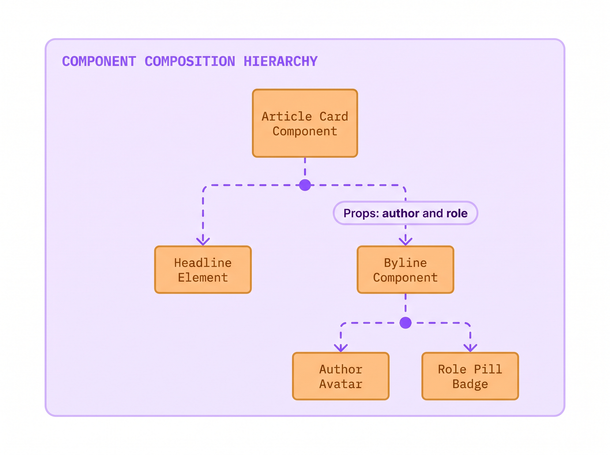
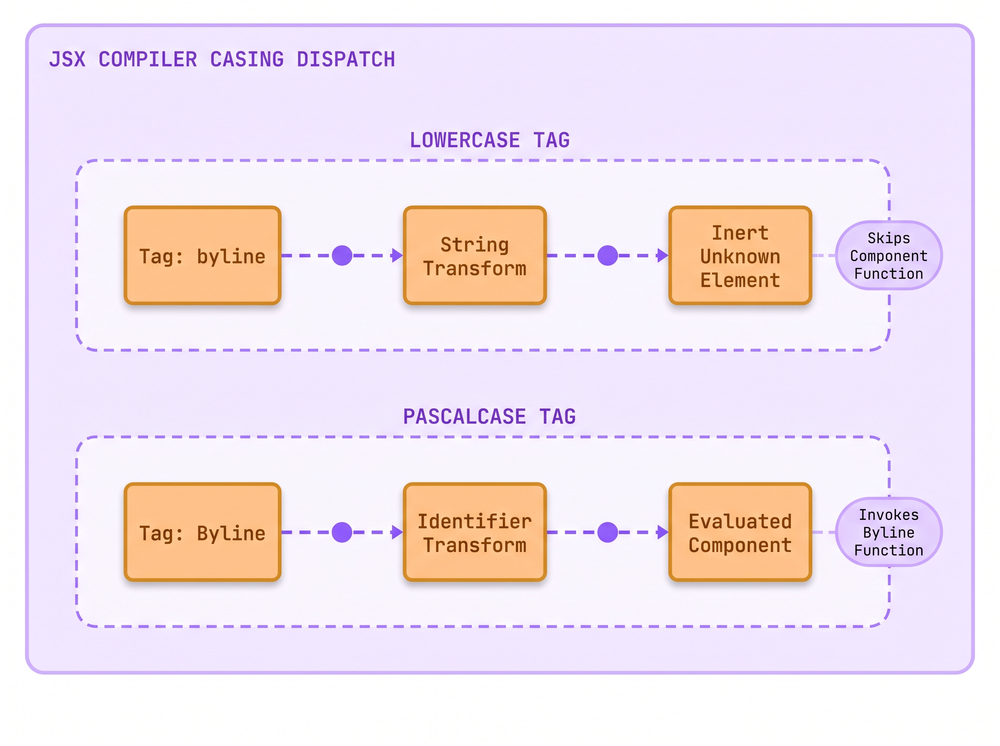
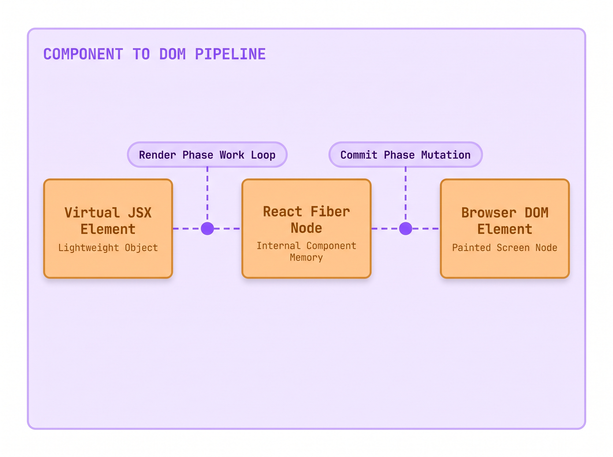
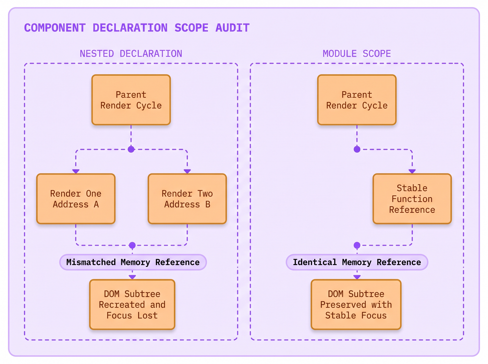
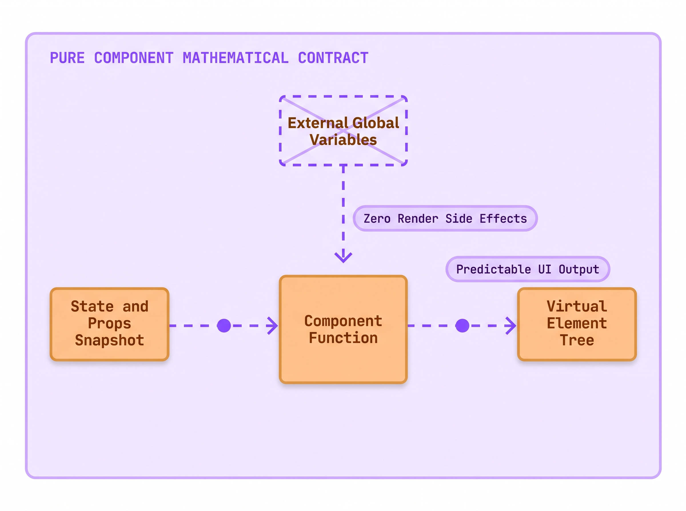

# Lecture 03: The Capitalized Function That Returns HTML
> INTERVIEW QUESTION | ❱ CORE | What is a React component, and what rules govern how you write one?

1. Maya Lin, an associate developer at The National Times, built an author byline card for breaking news articles.
2. The byline card showed the author photo and their full name. It also showed their job title and the publication date.
3. Maya wrote `<authorBadge author="Marcus" />` in lowercase, expecting React to run her component function.
4. In production, the article rendered a blank empty gap where the journalist credentials belonged.
5. When she inspected the DOM, the browser displayed an inert `<authorBadge></authorBadge>` tag with zero children.
6. Why did the browser treat her component function as an unknown HTML element instead of executing its code?
7. Today you will uncover the rules of component anatomy, and why capitalization determines whether your code runs.

### The Crime Scene: The Silent Unknown Tag

You already know how to write standard JavaScript functions. You declare a function name and pass parameters. The function calculates values and returns a result. You also know how to write HTML tags like `<div>` and `<p>` to structure documents in a browser.

When developers write their first React application, they encounter a function that appears to merge both worlds: a JavaScript function that returns HTML-like markup. But when Maya Lin published the breaking news byline card for *The National Times*, the interface collapsed silently.

Maya defined a JavaScript function named `authorBadge`. She expected React to execute the function and display the journalist profile. Instead, readers saw an empty space below the headline. When Maya opened browser DevTools to inspect the DOM tree, she did not find an error in the console. Instead, she found a literal, lowercase `<authorBadge></authorBadge>` element sitting completely empty in the page.

A **React component** is a JavaScript function that returns a description of user interface elements. You compose these functions together to build complex pages from small, isolated building blocks.

However, the build compiler and the browser engine do not guess your intentions. The JSX compiler relies on an explicit naming rule: **component names must always start with a capital letter (PascalCase)**.

When the compiler encounters a tag starting with a lowercase letter, such as `<byline>` or `<div>`, it treats the tag as a built-in browser host element. The compiler transforms it into a string literal. When the tag starts with a capital letter, such as `<Byline>` or `<ArticleCard>`, the compiler treats it as a direct JavaScript variable identifier. It passes the function itself into the React runtime so React can execute your component.

Here is the exact component call that triggered the silent failure on the news desk:

```jsx title="ArticleView.jsx"
function ArticleView() {
  return (
    <article className="news-article">
      <h1 className="headline">Metro Transit Expansion Approved</h1>
      <byline author="Marcus Vance" role="Urban Affairs" />
    </article>
  ); // **WRONG:** lowercase tag compiles to a string literal and produces an inert HTMLUnknownElement
}
```

```html-figure src="lab/01-forensic-investigator/figures/03-01-component-anatomy-rce.html" caption="React Component Explorer showing Byline correctly nested inside ArticleCard with file tree, component boundary tags, props chips, and authentic rendered newsroom UI."
```

When you examine the component explorer above, the intended architecture becomes visible immediately. The `<ArticleCard />` container hosts the headline and nests the `<Byline />` component. The byline receives its data through props. It displays the author photo and name. It also displays the author job title and publish time.

Because Maya wrote `<byline>` in lowercase, the JavaScript engine never executed her function. The browser created an `HTMLUnknownElement` in the live DOM. The browser did not know how to style or render `<byline>`, so it rendered an empty block with zero height.



> [svg image] In a **Component Composition Hierarchy**, the parent **Article Card Component** passes props down to child nodes, allowing the **Byline Component** to receive author data and render the **Author Avatar** and **Role Pill Badge**.

Understanding this distinction requires mastering the three fundamental rules that govern every React component:
1. **Capitalized Naming**: The function name and JSX tag must start with an uppercase letter (`Byline`, never `byline`).
2. **Top-Level Module Scope**: You must never define a component function inside another component function.
3. **Valid Return Value**: The function must return valid markup, such as a JSX element, a Fragment, or `null`.

### Under the Hood: The Capitalization Compiler Contract

When you write JSX in an editor, modern web browsers cannot run that syntax directly. Browsers understand standard JavaScript objects and functions, but they have no native parser for HTML tags inside JavaScript expressions.

Before your code reaches the browser, a build compiler transforms your JSX into standard JavaScript function calls. In modern React, the build compiler uses the automatic JSX runtime. The compiler scans your tags and decides what to output based entirely on the first letter of the tag name.

If the tag starts with a lowercase letter, the compiler emits a string literal: `_jsx('byline', { author: 'Marcus Vance' })`. When React processes this call, it sees a string. React assumes you are asking to create a native browser element like `<div>`, `<span>`, or `<section>`. React calls `document.createElement('byline')`, which produces an unknown DOM node.

If the tag starts with a capital letter, the compiler emits a direct variable identifier: `_jsx(Byline, { author: 'Marcus Vance' })`. Notice there are no quotes around `Byline`. React receives a direct pointer to your JavaScript function in memory. During the render phase, React executes `Byline(props)` to obtain the child elements.



> [svg image] The compiler inspects the first character of each tag name: a **Lowercase Tag** triggers a **String Transform** that creates an **Inert Unknown Element**, while a **PascalCase Tag** triggers an **Identifier Transform** that evaluates the **Component Function**.

Here is the corrected component implementation exported from its own dedicated file:

```jsx title="Byline.jsx"
export default function Byline({ author, role }) {
  return (
    <div className="byline-row">
      <div className="author-avatar">MV</div>
      <div className="author-name">{author}</div>
      <span className="author-role-pill">{role}</span>
    </div>
  ); // **RIGHT:** PascalCase component function returning semantic JSX markup
}
```

```html-figure src="lab/01-forensic-investigator/figures/03-02-compiler-casing-audit.html" caption="Symmetrical State Audit contrasting compiler output: lowercase tags become string literals creating blank HTMLUnknownElements, while PascalCase tags pass function identifiers that React executes."
```

In the compiler audit above, the two execution paths stand in sharp contrast. The lowercase tag produces a string literal, bypasses your component function entirely, and inserts an inert node into the DOM tree. The PascalCase tag preserves the function reference, invokes your code during rendering, and projects semantic HTML elements onto the screen.

To thoroughly understand this building block, we must examine the four foundational pillars of the **React Component**.

#### 1. Technical Nomenclature & Syntax Decoding
The word **component** originates from system architecture, meaning an interchangeable part of a larger mechanism. In React, a component is declared using standard JavaScript function syntax: `function Byline(props) { ... }`. The parameter `props` is a plain JavaScript object holding all incoming attributes passed by the parent element. The name must use **PascalCase** (every word capitalized, such as `ArticleCard` or `UserProfile`). This capitalization separates custom components from lowercase native HTML tags.

#### 2. Tactile Everyday Physical Analogy
Think of native HTML tags like standard pre-inked postal stamps sold by the post office. When you stamp `<div>` or `<p>`, the clerk stamps a standard official rectangle onto the envelope. You cannot teach that stamp new behaviors; it does only what the post office manufactured it to do. By contrast, a React component is like a custom 3D printing mold you carved in your own workshop. When you press `<Byline />`, the mold stamps out a complex assembly of an avatar circle, bold typography, and styled badges in a single press. Capitalizing the mold name tells the factory floor to fetch your custom blueprint rather than pulling a stock postal stamp from the drawer.

#### 3. The "Why We Suffered Before" Contrast
Before components became the industry standard, web development suffered from extreme file fragmentation. Developers maintained HTML templates in one folder, styles in a second folder, and jQuery DOM scripts in a third folder. If an engineer changed a class name in the markup, the JavaScript file broke silently because its query selectors no longer matched. Components permanently resolved this problem by keeping markup, display logic, and state together in a single place. When you need to update how a byline looks or behaves, you edit one file: `Byline.jsx`.

#### 4. The Physical Runtime Engine Routine
What does React do when it renders a component? When React executes your application, it maintains an internal tree of nodes called the **Fiber tree**. When React encounters `_jsx(Byline, props)`, it allocates a Fiber node whose `type` property points directly to the `Byline` function. During the work loop, React calls `Byline(props)`. The function evaluates and returns a child virtual element tree. React inspects those child elements, reconciles them against previous renders, and commits the calculated changes to the real browser DOM.



> [svg image] The execution pipeline transforms a **Virtual JSX Element** through the **Render Phase Work Loop** into a **React Fiber Node**, which commits changes to instantiate the live **Browser DOM Element**.

> [!KEY]
> **The PascalCase Invariant**: Never start a component name with a lowercase letter. React uses the initial capital letter to distinguish custom component functions from native HTML elements during JSX compilation.

### The Hidden Iceberg: The Nested Component Trap

Once engineers learn that components are regular JavaScript functions, they frequently fall into a catastrophic architectural trap: nesting component declarations inside other components.

During a late-night editorial deadline, an engineer at *The National Times* wanted to display a live reader comment counter inside the article view. To keep the helper function close to the article code, the engineer declared `function CommentCounter()` directly inside `function ArticleView()`.

The component appeared to work on the first paint. But when readers started typing comments into the text box, every single keystroke caused the input field to lose focus. Keystrokes were dropped, text was lost, and readers could not submit comments.

Here is the exact code that caused the focus-loss disaster:

```jsx title="ArticleView.jsx"
export default function ArticleView() {
  function CommentCounter({ count }) { // **WRONG:** function re-declared on every parent render
    return <span className="comment-counter">Comments: {count}</span>;
  }

  return (
    <div className="article-view">
      <CommentCounter count={12} />
      <input type="text" placeholder="Write a response..." />
    </div>
  );
}
```

Why did declaring `CommentCounter` inside `ArticleView` cause the input field to lose focus on every keystroke?

To answer this question, you must examine how the JavaScript language executes functions in memory. Every time a parent component re-renders, the JavaScript runtime executes its function body from top to bottom.

When `ArticleView` runs, it encounters the function declaration `function CommentCounter() { ... }`. JavaScript allocates a brand-new function object at a fresh memory address. On render one, `CommentCounter` lives at Memory Address A. On render two, `CommentCounter` lives at Memory Address B.

When React compares the previous virtual tree against the new virtual tree (a comparison routine known as **reconciliation**), it checks whether the component type at that tree position is identical: `prevFiber.type === nextFiber.type`.

Because Memory Address A does not equal Memory Address B, React concludes that the old component was completely removed from the page and a totally different component was added in its place.

React destroys the old DOM subtree entirely, unmounting all child elements. It then creates a brand-new DOM node from scratch. When a native `<input>` element is destroyed and recreated in the DOM, the browser immediately discards its active cursor selection and keyboard focus. The user experiences a jarring flicker and loses their typing position on every keystroke.

The official React documentation explicitly warns against this pattern:

> Components can render other components, but you must never nest their definitions... The snippet above is very slow and causes bugs. Instead, define every component at the top level.
*React Official Documentation (Your First Component), `documentation official/React 19 Sept 2026/react.dev/src/content/learn/your-first-component.md`*

To permanently eliminate this failure mode, always declare your component functions at the top level of your module. If a child component needs data from its parent, pass that data through **props** rather than relying on nested function closures.

```jsx title="ArticleView.jsx"
function CommentCounter({ count }) { // **RIGHT:** declared at top-level module scope
  return <span className="comment-counter">Comments: {count}</span>;
}

export default function ArticleView() {
  return (
    <div className="article-view">
      <CommentCounter count={12} />
      <input type="text" placeholder="Write a response..." />
    </div>
  );
}
```

When `CommentCounter` is declared at module scope, its function reference remains constant across all render cycles (`prevFiber.type === nextFiber.type` evaluates to `true`). React recognizes that the component identity has not changed. It preserves the existing DOM nodes in memory, updates only the text content that changed, and keeps the user's input focus perfectly intact.



> [svg image] Declaring a component inside another creates a new memory address on every render, causing a **Nested Declaration** failure where the DOM subtree is recreated and focus is lost. In contrast, **Module Scope** preserves a **Stable Function Reference** and keeps the DOM subtree intact.

> [!WISDOM]
> **Component Identity Survives at Module Scope**: Declare components at the top level of your file. Nesting component definitions inside other components destroys their memory identity on every render, causing React to unmount the entire DOM subtree and reset user focus.

### The Return Value Contract: Pure Elements and Semicolon Hazards

Every React component must return something that React knows how to render. If a component function finishes executing without returning a value, JavaScript returns `undefined`. React 19 treats returning `undefined` as a runtime error because it usually indicates a forgotten return statement.

A valid React component can return:
1. **A JSX Element**: A description of a single DOM element or custom component (`<div className="card" />`).
2. **A React Fragment**: An empty wrapper tag (`<>...</>`) that groups multiple elements without creating an extra DOM wrapper node.
3. **A Primitive Value**: A string (`"Breaking News"`) or number (`42`), which React renders as raw text nodes.
4. **Nothing**: `null` or `false`, which tells React to render nothing on screen without throwing an error.



> [svg image] Under the pure component contract, a **Component Function** receives an immutable **State and Props Snapshot** and returns a **Virtual Element Tree** with zero external side effects.

Here is a subtle JavaScript syntax trap that catches both junior and senior developers: **Automatic Semicolon Insertion (ASI)**.

In JavaScript, if you place a line break immediately after the `return` keyword, the parser automatically inserts a hidden semicolon before your next line:

```jsx title="BrokenReturn.jsx"
export default function BrokenReturn() {
  return // JavaScript inserts a semicolon here: return;
    <div className="alert">
      Important editorial notice
    </div>;
} // **WRONG:** function returns undefined before reaching the JSX markup
```

Because JavaScript inserts a semicolon after `return`, the function returns `undefined` immediately. The JSX block below is completely ignored. To prevent this hazard, always place your opening tag on the same line as `return`, or wrap your multi-line markup in grouping parentheses:

```jsx title="SafeReturn.jsx"
export default function SafeReturn() {
  return (
    <div className="alert">
      Important editorial notice
    </div>
  ); // **RIGHT:** parentheses protect multi-line JSX from automatic semicolon insertion
}
```

Wrapping your JSX in parentheses ensures that JavaScript treats the entire block as a single unified expression, guaranteeing that your markup reaches the React runtime cleanly.

### The Senior Interview Masterclass: Architectural Rules of Components

In staff and senior engineering interviews, questions about component anatomy are rarely about basic syntax. Interviewers use component rules to test whether you understand the boundary between compile-time transformation and runtime reconciliation.

A common senior interview question asks:

> *"Why does React forbid calling components as regular functions inside JSX? What breaks if you write `{Byline(props)}` instead of `<Byline {...props} />`?"*

A junior developer might answer that `<Byline />` looks cleaner or that JSX requires tags.

A senior engineer explains the fundamental difference in engine lifecycle.

When you write `<Byline {...props} />`, you hand a virtual element descriptor to React. React takes responsibility for running the component. It allocates a dedicated Fiber node in the component tree. It attaches hooks (`useState`, `useEffect`) to that specific node, and it manages component error boundaries.

If you write `{Byline(props)}`, you bypass React entirely. You execute `Byline` as a plain helper function inside the parent component's execution frame.

This creates severe architectural consequences:
1. **Hook Ownership Collapse**: Any hooks called inside `Byline` are attached to the *parent* component's Fiber node rather than their own node. If `Byline` is called conditionally, it breaks the invariant that hooks must always be called in the exact same order.
2. **Reconciliation Inefficiency**: React cannot optimize or skip rendering `Byline` independently. When the parent re-renders, the entire helper function executes unconditionally.
3. **DevTools Invisibility**: React DevTools cannot display a component that was never registered as a component. The helper's output merges indistinguishably into the parent.

> [!TIP]
> **To impress the interviewer:** Frame your answer around **Fiber node allocation, hook encapsulation, and compiler boundaries**. Say: *"Writing `<Byline />` creates a React element. This tells the reconciler to create a separate Fiber node with its own hook storage and lifecycle. In contrast, calling `{Byline()}` runs the function directly inside the parent render pass. That steals the parent hook slots and stops React from isolating re-renders or error boundaries."*

### Where you will meet this

1. **Design System Libraries**: Creating reusable button, badge, and card components that teams share across applications.
2. **Editorial Mastheads**: Organizing complex news homepages into clear component trees, including navigation bars and weather widgets.
3. **Interactive Comment Feeds**: Structuring user discussion threads where parent article views host lists of nested comment cards.
4. **Dashboard Analytics**: Composing financial charts and data summary cards from reusable components.

### Glossary

- **React Component**: A JavaScript function whose name starts with a capital letter that returns React elements describing user interface structure.
- **PascalCase**: A naming convention where the first letter of every word is capitalized (`ArticleCard`), mandatory for React component declarations.
- **Fiber Tree**: The internal in-memory tree of nodes that React maintains to track component instances, hooks, and pending DOM mutations.
- **Reconciliation**: The comparison routine where React diffs the newly returned virtual element tree against the previous tree to find only the exact nodes that changed.
- **Automatic Semicolon Insertion (ASI)**: A JavaScript parsing behavior where the engine automatically inserts semicolons at line breaks, requiring parentheses around multi-line return statements.
- **HTMLUnknownElement**: The generic DOM interface instantiated by browsers when encountering unrecognized HTML tags, such as lowercase component names.

### Summary

**Component Anatomy and Rules**

Mastering component anatomy requires treating components as pure functional building blocks governed by strict compiler and reconciliation contracts.

❒ The Capitalization Contract
1. Tag casing dictates compiler code generation:
<br>&nbsp;&nbsp;&nbsp;&nbsp;(a) Lowercase tags compile into string literals (`_jsx('tag')`) targeting native host DOM elements.
<br>&nbsp;&nbsp;&nbsp;&nbsp;(b) Capitalized tags compile into variable identifiers (`_jsx(Tag)`) passing function pointers to React.
<br>&nbsp;&nbsp;&nbsp;&nbsp;(c) Mismatched casing creates empty `HTMLUnknownElement` nodes that fail to execute component logic.
2. Principles to remember:
➔ NEVER name a component with a lowercase first letter.
➔ ALWAYS use PascalCase for all custom component declarations and JSX tags.

❒ The Module Scope Invariant
1. Component function identity must remain stable across render cycles:
<br>&nbsp;&nbsp;&nbsp;&nbsp;(a) Declaring a component inside another creates a new function memory reference on every parent render.
<br>&nbsp;&nbsp;&nbsp;&nbsp;(b) Unstable references force the reconciler to destroy and recreate the underlying DOM subtree.
<br>&nbsp;&nbsp;&nbsp;&nbsp;(c) Subtree recreation resets local component state and drops native input focus.
2. Operational rule:
➔ IF a component needs helper components, THEN declare those helpers at module scope and pass data via props.
➔ NEVER declare a component function inside the body of another component function.

**DO NOT DO THIS:** Define component functions inside another component or use lowercase tag names
```jsx wrong
function newsFeed() {
  function article() {
    return <div>Article item</div>;
  }
  return <article />;
}
```

**DO THIS:** Declare capitalized components at top-level module scope and compose them cleanly
```jsx right
function ArticleItem() {
  return <div className="article-item">Article item</div>;
}

export default function NewsFeed() {
  return (
    <section className="news-feed">
      <ArticleItem />
    </section>
  );
}
```

| | **Native Host Element**<br>(Built-in DOM) | **React Custom Component**<br>(User-defined) |
| ---: | :--- | :--- |
| **Naming Convention** | Strictly lowercase or kebab-case (`<div>`, `<section>`, `<input>`) | Strictly PascalCase with capital initial letter (`<Byline>`, `<ArticleCard>`) |
| **Compiler Output** | Emits string literal to JSX runtime (`_jsx('div', props)`) | Emits direct function variable identifier (`_jsx(Byline, props)`) |
| **Runtime Execution** | Directly invokes browser `document.createElement(tagName)` | React invokes function `Component(props)` to evaluate child elements |
| **Declaration Scope** | Predefined by the W3C HTML specification and browser engine | Defined by the developer at top-level JavaScript module scope |
| **State and Lifecycle** | Managed natively by the browser layout engine | Managed by React Fiber reconciler via hooks and component trees |
