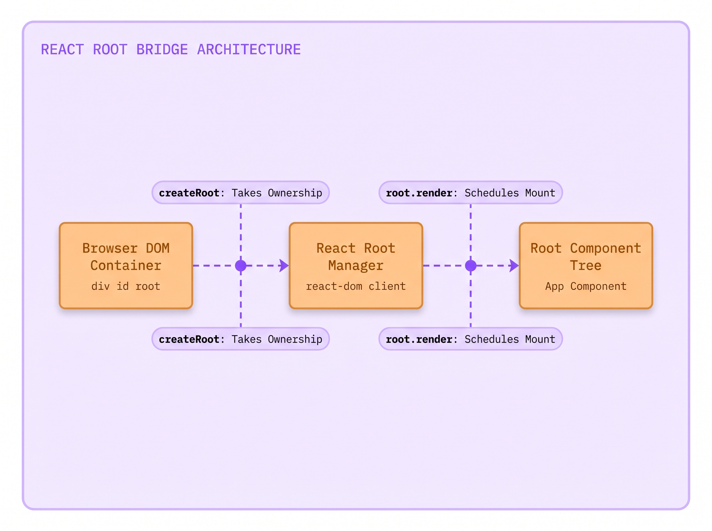
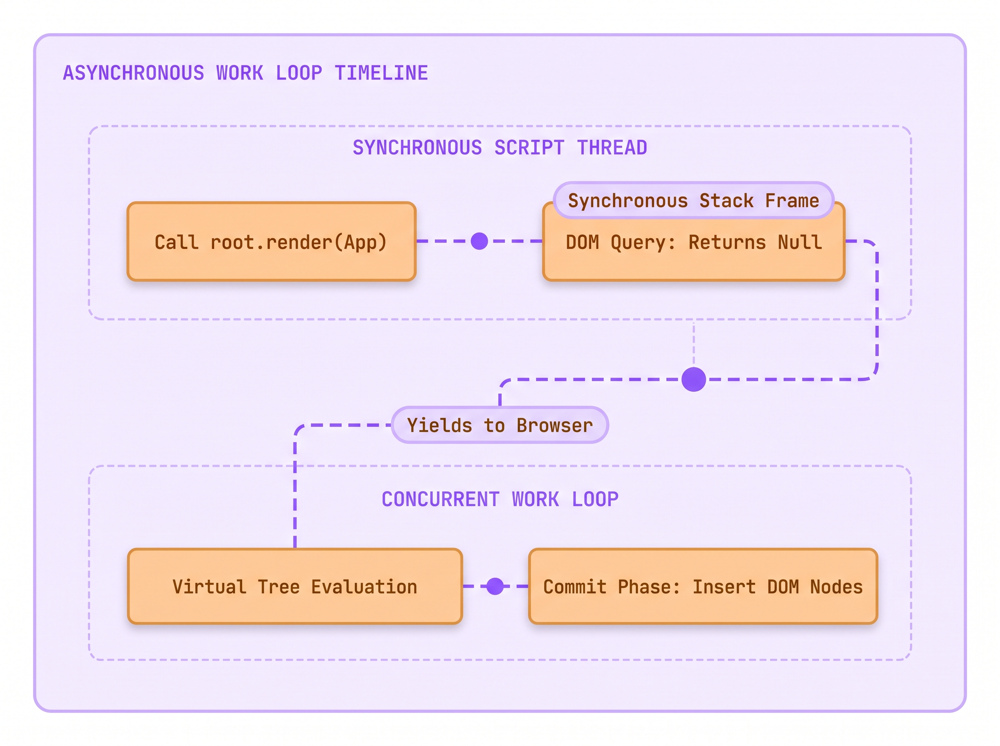
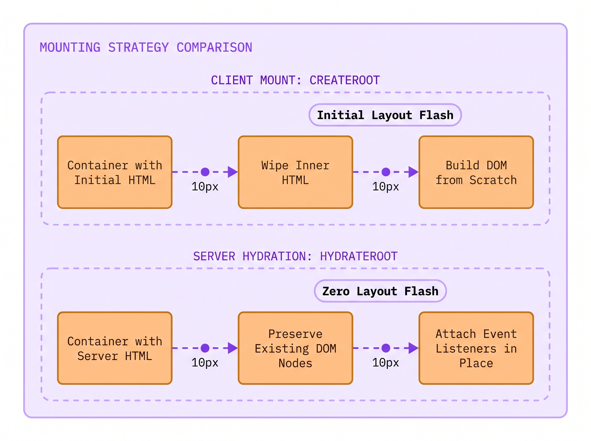
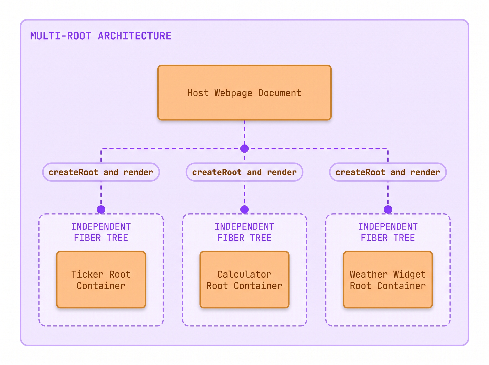
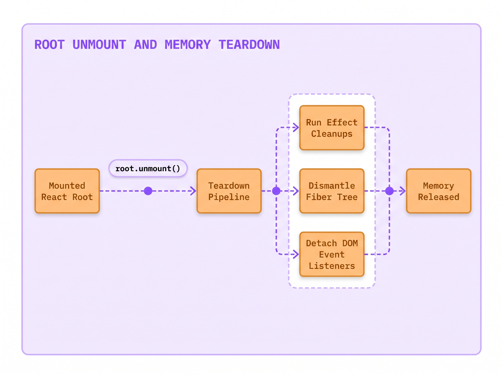

# Lecture 04: How the Root Component Lands on the Page
> INTERVIEW QUESTION | ❱ CORE | You wrote App.jsx. How does it actually get onto the page?

1. Samira Vance, a platform engineer at The National Times, prepared the breaking news live wire widget on Monday morning.
2. The widget sat inside an existing editorial page containing a static fallback ticker inside `<div id="root">`.
3. Samira called `createRoot(container).render(<App />)` to activate live updates for readers.
4. The moment the script executed, the existing ticker vanished into a blank white box before rendering.
5. Furthermore, an inline script directly below `render()` tried to read the headline and crashed with `null`.
6. Why did mounting React wipe out the existing fallback markup and fail to populate the DOM synchronously?
7. Today you will uncover how `createRoot` bridges JavaScript to the DOM, and how React schedules your initial render.

### The Crime Scene: The Vanishing Ticker and the Null Element

You already know how to author React components. You write a function, return JSX elements, and compose child components into a structured visual hierarchy. But components authored in `.jsx` or `.tsx` files are simply JavaScript functions in memory. They do not attach themselves to the browser window automatically.

When developers inspect modern build templates, they find an `index.html` file containing an empty container: `<div id="root"></div>`. Somewhere in their project scripts, a single function bridges that empty container to their root component.

When Samira Vance deployed the breaking news live wire widget for *The National Times*, that bridge produced two baffling production failures.

First, the newsroom page was not an empty document. To protect readers on slow mobile networks, the backend server had rendered a static fallback news ticker directly inside `<div id="root">`. The headline was visible and readable immediately. But the moment Samira's script loaded, the headline vanished into a blank white box. Half a second later, the React component finally mounted, creating an unexpected visual flicker on the page.

Second, Samira wrote an analytics tracker on the line immediately following `root.render(<App />)`. The tracker ran `document.getElementById('live-headline')` to log the initial story title. To her shock, the expression returned `null`. The browser threw a fatal TypeError, halting the analytics pipeline.

React does not push HTML strings into the browser synchronously like `innerHTML`. Instead, React uses a dedicated package called **`react-dom/client`**.

The bridge between your JavaScript code and the browser window is created using the **`createRoot`** function. Calling `createRoot(domNode)` creates a **React Root**, a specialized management container that takes complete authority over the provided DOM node.

When you call `createRoot` on a container, React prepares that container for pure client-side rendering. On its initial render, `createRoot` intentionally clears all pre-existing HTML inside that container to ensure that client-managed nodes start from a pristine state.

Furthermore, calling `root.render(<App />)` does not build DOM elements synchronously. Instead, `root.render` schedules a render pass on React's internal concurrent work loop and returns `undefined` immediately. The JavaScript thread keeps running before the browser paints a single DOM node.



> [svg image] The **Browser DOM Container** is claimed by the **React Root Manager** through createRoot, which takes ownership and schedules mounting for the **Root Component Tree** via root.render.

Here is the exact setup code that Samira ran in production:

```tsx title="main.tsx"
import { createRoot } from 'react-dom/client';
import App from './App';

const container = document.getElementById('root');
if (container) {
  const root = createRoot(container);
  root.render(<App />); // **WRONG:** assuming render is synchronous and leaves existing HTML intact
  console.log(container.innerHTML); // prints empty or pre-render state
}
```

```html-figure src="lab/01-forensic-investigator/figures/04-01-create-root-explorer.html" caption="React Component Explorer illustrating index.html with div id root, main.tsx calling createRoot, and the mounted App component on the blueprint canvas."
```

When you examine the component explorer above, the architectural boundary becomes tangible. The physical browser document owns `<div id="root">`. React takes ownership of that DOM node through `createRoot`. Inside that boundary, React mounts `<App />`, displaying the live desk badge, reader metrics, and news feed.

Because Samira used `createRoot` on a container that already held server-rendered HTML, React wiped the container clean before rendering. And because she expected `root.render` to execute synchronously, her analytics query ran while the container was still empty.

Understanding this bridge requires mastering the complete lifecycle of the React Root:
1. **Container Acquisition**: Finding a valid, non-null DOM element using native Web APIs.
2. **Root Creation**: Calling `createRoot` to allocate a concurrent Fiber root container.
3. **Scheduled Mounting**: Calling `root.render` to enqueue the root element onto the work loop.
4. **Lifecycle Teardown**: Calling `root.unmount` when removing a React application from the page.

### Under the Hood: The createRoot Contract and FiberRootNode

To master how React connects to the web browser, you must separate the core React library from its platform renderers.

The core `react` package is completely platform-agnostic. It defines what a component is, how hooks store state, and how elements are constructed. It has no knowledge of browsers, DOM nodes, HTML tags, or mobile operating systems.

The bridge between React and the browser document lives in a distinct companion package: **`react-dom`**. Specifically, modern client-side mounting APIs live in the submodule **`react-dom/client`**.

When you execute `const root = createRoot(domNode, options?)`, React performs several critical operations in browser memory.

First, React validates that `domNode` is a legitimate browser Element. If you pass `null` or `undefined` (for example, if `document.getElementById('root')` failed to find a match), `createRoot` immediately throws a descriptive error.

Second, React allocates an internal engine object known as a **`FiberRootNode`**. The `FiberRootNode` serves as the administrative hub for your entire application. It stores the pending work queue and tracks scheduler priority. It also manages error boundaries and holds a pointer to the host DOM container.

Third, `createRoot` returns a lightweight JavaScript object containing exactly two public methods:
- **`render(reactNode)`**: Schedules the provided React component tree to be displayed inside the root container.
- **`unmount()`**: Destroys the React tree and removes all event listeners to clean up memory.

Here is the production-grade entry point showing modern React 19 configuration options:

```tsx title="main.tsx"
import { createRoot } from 'react-dom/client';
import App from './App';

const domNode = document.getElementById('root')!;
const root = createRoot(domNode, {
  identifierPrefix: 'nt-live-', // **RIGHT:** prefixes IDs for useId to prevent multi-root collisions
  onRecoverableError(error, errorInfo) {
    console.error('Recoverable root error:', error, errorInfo.componentStack);
  },
});
root.render(<App />);
```

```html-figure src="lab/01-forensic-investigator/figures/04-02-createroot-vs-hydrateroot-audit.html" caption="Symmetrical State Audit contrasting createRoot client rendering vs hydrateRoot server markup adoption and listener attachment."
```

In the audit above, the mechanical distinction between client-side mounting and server-side hydration is stark. While `createRoot` prepares a blank slate by clearing existing DOM nodes, `hydrateRoot` preserves pre-existing HTML and attaches event listeners directly to matching elements.

To thoroughly comprehend this mounting foundation, we must examine the four foundational pillars of **`createRoot`**.

#### 1. Technical Nomenclature & Syntax Decoding
The function name **`createRoot`** explicitly describes its architectural role. In computer science, a tree data structure must have a single starting node called the root. `createRoot` accepts two arguments: a physical `domNode` (the host element) and an optional `options` configuration object. In React 19, options include `identifierPrefix` (used by `useId` to prevent ID collisions when multiple roots share a page) and specialized error callbacks like `onCaughtError`, `onUncaughtError`, and `onRecoverableError`.

#### 2. Tactile Everyday Physical Analogy
Think of the browser's native DOM like an industrial cargo dock. The cargo dock is built out of heavy concrete and steel, capable of holding any standard shipping container. Think of React as an automated robotic warehousing system that operates on its own proprietary digital schedule. You cannot simply drop the robotic system directly onto the raw concrete without an interface. `createRoot` is like bolting down a heavy-duty docking adapter to a specific bay on the dock. Once the docking adapter is locked in place, the robotic crane (`root.render`) can load and unload thousands of digital packages without disturbing the rest of the harbor.

#### 3. The "Why We Suffered Before" Contrast
Before React 18, applications were mounted using a legacy method: `ReactDOM.render(<App />, domNode)`. The legacy API suffered from a fatal architectural flaw: it was completely synchronous. When you called `ReactDOM.render`, React took over the JavaScript main thread and refused to yield until the entire component tree was constructed and committed to the DOM. If your tree contained thousands of nodes, the browser froze completely. Keystrokes were dropped and animations stuttered. Furthermore, the legacy method had no way to pause work or prioritize urgent user gestures. `createRoot` replaced this legacy API by unlocking the concurrent scheduler, allowing React to break large rendering tasks into small, non-blocking time slices.

#### 4. The Physical Runtime Engine Routine
What happens under the hood when `createRoot(domNode)` executes? React initializes a `FiberRootNode` and points its `containerInfo` property to `domNode`. It attaches event listeners to `domNode` so React can catch all user events from child elements. When you call `root.render(<App />)`, React wraps your element in an update object. It places this update into the root's work queue, where the scheduler assigns it execution time.

> [!KEY]
> **The Root API Return Value**: `createRoot` returns a root object with two methods: `render` and `unmount`. The `render` method returns `undefined`. Never attempt to chain methods after `render()` or await its completion as a Promise.

### The Hidden Iceberg: The Asynchronous Mount Trap

The second failure in our crime scene occurred when Samira tried to query the DOM on the line immediately following `root.render(<App />)`.

Many developers assume that calling `render` works like calling a synchronous utility function. They expect that by the time line two executes, line one has already completed its job and updated the browser screen.

In modern React 19, this assumption is completely false.

When you call `root.render(<App />)`, React does not construct DOM nodes immediately. Instead, `root.render` simply packages your root component into an update payload and deposits it onto the **concurrent work loop**. React then returns control of the thread back to your code immediately.

Here is the naive code that crashes in production:

```tsx title="BrokenMount.tsx"
const root = createRoot(document.getElementById('root')!);
root.render(<App />);
const headline = document.getElementById('live-headline'); // DOM elements not rendered yet
headline.classList.add('highlight'); // **WRONG:** throws TypeError because headline is null
```

Why does this fail? Because JavaScript executes code sequentially on a single thread. The synchronous lines following `root.render` execute in the current call stack frame. React's work loop has not even begun to evaluate `<App />` yet.

The browser engine has not created the DOM elements. It has not calculated layout positions or painted pixels on the screen. Searching for `#live-headline` finds nothing because the container is still completely empty.



> [svg image] On the **Synchronous Script Thread**, executing a DOM query immediately after calling render fails because the **Concurrent Work Loop** evaluates and commits DOM nodes asynchronously.

If your application needs to interact with real DOM elements after they appear on screen, you must never write queries in your entry file. Instead, you must let React manage the lifecycle. Place your DOM operations inside an effect hook (`useEffect` or `useLayoutEffect`) inside the component that actually renders those nodes:

```tsx title="LiveHeadline.tsx"
import { useEffect, useRef } from 'react';

export default function LiveHeadline({ title }) {
  const headlineRef = useRef<HTMLHeadingElement>(null);

  useEffect(() => {
    if (headlineRef.current) {
      headlineRef.current.classList.add('highlight'); // **RIGHT:** runs safely after commit phase
    }
  }, []);

  return <h1 id="live-headline" ref={headlineRef}>{title}</h1>;
}
```

By using `useEffect`, you guarantee that your logic runs during the **commit phase**, the exact moment after React has created the native DOM elements and inserted them into the browser document.

> [!WISDOM]
> **Never Race the Scheduler**: Code written immediately after `root.render()` runs before React mounts your components. To touch real DOM elements, use a `ref` inside a `useEffect` hook, which runs only after the commit phase has placed elements in the document.

### Client Mounting versus Server Hydration: Why createRoot Wipes HTML

The first failure on *The National Times* news desk was the vanishing ticker. Why did `createRoot` wipe out the server-rendered fallback HTML?

When you call `createRoot`, you explicitly declare: *"This container belongs entirely to a client-side Single-Page Application."*

Because client-side applications assume that all markup originates from client JavaScript, React clears whatever text or markup was sitting inside `container` prior to mounting. If you had static HTML or loading spinners inside `<div id="root">`, React removes them so they do not conflict with the incoming virtual tree.

The official React documentation explicitly documents this caveat:

> The first time you call `root.render`, React will clear all the existing HTML content inside the React root before rendering the React component into it. If your root's DOM node contains HTML generated by React on the server or during the build, use `hydrateRoot()` instead, which attaches the event handlers to the existing HTML.
*React Official Documentation (createRoot), `documentation official/React 19 Sept 2026/react.dev/src/content/reference/react-dom/client/createRoot.md`*

If your application uses **Server-Side Rendering (SSR)** or **Static Site Generation (SSG)**, your server has already built complete, accessible HTML. The user is already reading the headline.

Wiping that HTML and rebuilding it from scratch wastes CPU cycles and creates an unappealing white flash.

In server-rendered applications, you must use **`hydrateRoot`** instead of `createRoot`.

```tsx title="main.tsx"
import { hydrateRoot } from 'react-dom/client';
import App from './App';

const container = document.getElementById('root')!;
hydrateRoot(container, <App />); // **RIGHT:** preserves existing server HTML and binds listeners
```

When you call `hydrateRoot`, React adopts the existing browser DOM elements in place. It steps through each node and checks that the server markup matches your component output. Then it attaches interactive click and keyboard listeners directly to the existing elements. The user experiences zero layout shift, zero visual flicker, and instant interactivity.



> [svg image] Comparing mounting strategies: **Client Mount** with **createRoot** clears pre-existing container markup to rebuild from scratch, while **Server Hydration** with **hydrateRoot** preserves existing DOM nodes and attaches event listeners in place.

### The Senior Interview Masterclass: Multi-Root Architecture and Teardown

In technical interviews for senior and lead roles, interviewers often push beyond the standard single-page application setup:

> *"Can you have more than one `createRoot` call on a single webpage? When would you use multiple roots, and how do you clean them up?"*

A junior developer often assumes that every webpage has exactly one root, because that is what starter templates provide.

A senior engineer understands that React is a library, not an all-or-nothing framework.

You can create as many independent roots on a single page as your architecture requires. This pattern is known as **Multi-Root Architecture** or "sprinkling React" into a larger system.

Consider a large multi-page publication like *The National Times*. The core article pages may be generated by a traditional server framework like Ruby on Rails, Django, or WordPress. The vast majority of the page is plain, static HTML.

However, the page might feature three isolated interactive widgets:
1. A live stock ticker in the top navigation bar: `<div id="stock-ticker-root"></div>`.
2. An interactive financial calculator embedded in the middle of an editorial piece: `<div id="calculator-root"></div>`.
3. A real-time weather widget in the sidebar: `<div id="weather-root"></div>`.

Instead of forcing the entire website into a monolithic Single-Page Application, you call `createRoot` three times:

```tsx title="widgets.tsx"
import { createRoot } from 'react-dom/client';
import StockTicker from './StockTicker';
import Calculator from './Calculator';
import WeatherWidget from './WeatherWidget';

const tickerEl = document.getElementById('stock-ticker-root');
if (tickerEl) createRoot(tickerEl).render(<StockTicker />);

const calcEl = document.getElementById('calculator-root');
if (calcEl) createRoot(calcEl).render(<Calculator />);

const weatherEl = document.getElementById('weather-root');
if (weatherEl) createRoot(weatherEl).render(<WeatherWidget />);
```

Each root operates as its own independent React application with its own Fiber tree, its own state boundaries, and its own concurrent scheduler.



> [svg image] In a **Multi-Root Architecture**, a single host webpage connects to multiple independent root containers, each running its own isolated **Independent Fiber Tree** and component lifecycle.

However, senior engineers must manage the critical danger of multi-root setups: **memory leaks**.

Suppose your page opens and closes pop-up windows, or navigates between tabs without a full refresh. If an outer script simply deletes the container from the DOM, React's internal Fiber trees and event listeners remain stuck in memory.

To prevent memory leaks, always capture the root instance and call **`root.unmount()`** before destroying the host container:

```tsx title="modal-manager.ts"
import { createRoot, Root } from 'react-dom/client';
import ModalWidget from './ModalWidget';

let modalRoot: Root | null = null;

export function openModal(container: HTMLElement) {
  modalRoot = createRoot(container);
  modalRoot.render(<ModalWidget />);
}

export function closeModal() {
  if (modalRoot) {
    modalRoot.unmount(); // **RIGHT:** destroys Fiber tree, detaches listeners, and frees memory
    modalRoot = null;
  }
}
```

Calling `root.unmount()` tells React to run all cleanup functions in `useEffect` hooks. It removes the entire component tree and detaches all event listeners from the DOM node.



> [svg image] The teardown pipeline begins when **root.unmount()** is called, executing **Run Effect Cleanups**, dismantling the Fiber tree, and detaching DOM event listeners until memory is released.

> [!TIP]
> **To impress the interviewer:** Highlight how **`createRoot` empowers micro-frontend and multi-root architectures**. Say: *"A page is not limited to one root. In multi-page apps or micro-frontends, we can instantiate multiple roots on distinct DOM nodes with unique `identifierPrefix` values to avoid `useId` collisions. Crucially, when an outer framework destroys a widget's DOM node, we must call `root.unmount()` to invoke effect cleanups and avoid detached DOM memory leaks."*

### Where you will meet this

1. **Enterprise Portals**: Embedding React-powered widgets into legacy server-rendered enterprise dashboards.
2. **E-Commerce Checkouts**: Mounting an interactive payment and cart drawer into a static product catalog.
3. **Newsroom Graphics**: Injecting dynamic weather maps, survey counters, and interactive charts into static newspaper articles.
4. **Micro-Frontend Layouts**: Managing independent frontend applications owned by different teams on a unified page.

### Glossary

- **React Root**: The top-level management container that connects a browser DOM element to an in-memory React Fiber tree.
- **`createRoot`**: The client-side entry point in `react-dom/client` that initializes a root and enables concurrent rendering.
- **`hydrateRoot`**: The server-side companion entry point in `react-dom/client` that preserves pre-rendered server HTML and attaches event listeners.
- **FiberRootNode**: The internal engine data structure holding the scheduler queue, priority levels, and DOM container reference.
- **`root.unmount()`**: The method that dismantles a mounted React application, runs effect cleanups, and frees memory.
- **`identifierPrefix`**: A configuration option in `createRoot` that prepends a unique string to all IDs generated by `useId`.

### Summary

**The React Root Lifecycle**

The React Root bridges platform-agnostic React components to the physical browser window, managing mounting, concurrent scheduling, and clean teardown.

❒ The Mounting Protocol
1. Mounting connects host DOM containers to the React reconciler:
<br>&nbsp;&nbsp;&nbsp;&nbsp;(a) `createRoot(domNode)` takes ownership of the host container element.
<br>&nbsp;&nbsp;&nbsp;&nbsp;(b) Client mounting clears existing HTML inside the container to prevent structural drift.
<br>&nbsp;&nbsp;&nbsp;&nbsp;(c) `root.render(<App />)` enqueues the component tree onto the concurrent work loop and returns `undefined`.
2. Principles to remember:
➔ NEVER expect `root.render()` to run synchronously or return a DOM element.
➔ ALWAYS query DOM nodes inside `useEffect` with a `ref` rather than writing synchronous DOM queries in your entry file.

❒ The Hydration and Teardown Contracts
1. Choose the mounting method that matches your HTML source:
<br>&nbsp;&nbsp;&nbsp;&nbsp;(a) Use `createRoot` for pure client-side single-page applications and embedded widgets.
<br>&nbsp;&nbsp;&nbsp;&nbsp;(b) Use `hydrateRoot` for server-rendered HTML to prevent white flashes and preserve existing markup.
<br>&nbsp;&nbsp;&nbsp;&nbsp;(c) Call `root.unmount()` whenever a dynamic container is removed from the page to prevent memory leaks.
2. Operational rule:
➔ IF the page already contains server-rendered HTML inside the container, THEN use `hydrateRoot` instead of `createRoot`.
➔ IF an embedded React widget container is discarded by an outer system, THEN call `root.unmount()` before removing the container.

**DO NOT DO THIS:** Call createRoot on server-rendered HTML or write synchronous DOM queries after render
```tsx wrong
const container = document.getElementById('root')!;
const root = createRoot(container);
root.render(<App />);
const title = container.querySelector('h1')!.textContent;
```

**DO THIS:** Configure createRoot cleanly and interact with DOM nodes through component lifecycle hooks
```tsx right
import { createRoot } from 'react-dom/client';
import App from './App';

const container = document.getElementById('root');
if (container) {
  const root = createRoot(container);
  root.render(<App />);
}
```

| | **Client Mount: `createRoot`**<br>(react-dom/client) | **Server Hydration: `hydrateRoot`**<br>(react-dom/client) |
| ---: | :--- | :--- |
| **Container Pre-Action** | Clears all pre-existing inner HTML inside the container element | Preserves existing inner HTML painted by the server engine |
| **Execution Model** | Builds DOM elements from scratch via client JavaScript work loop | Matches virtual elements against existing DOM nodes and binds handlers |
| **Layout Shift Risk** | Triggers visual flash if server-rendered content was already visible | Zero visual flash; content remains stable while becoming interactive |
| **Primary Use Case** | Pure client SPAs, private dashboards, and standalone canvas tools | Public content sites, news publications, and e-commerce stores |
| **Lifecycle Teardown** | Invoked via `root.unmount()` to destroy tree and free memory | Invoked via `root.unmount()` to detach listeners and release resources |
