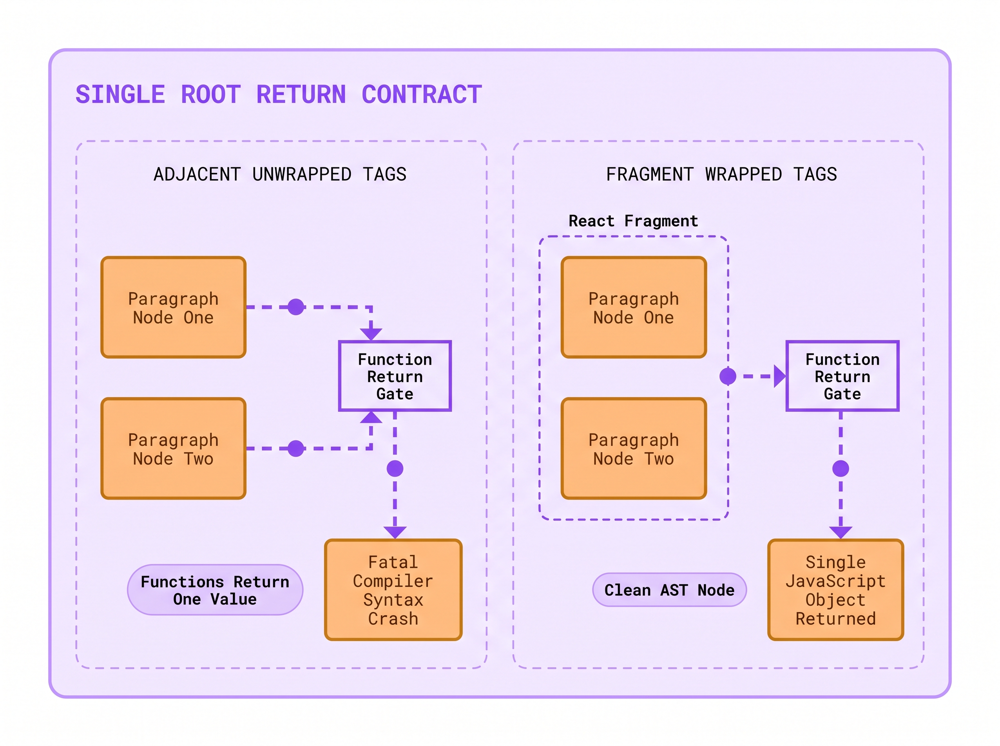
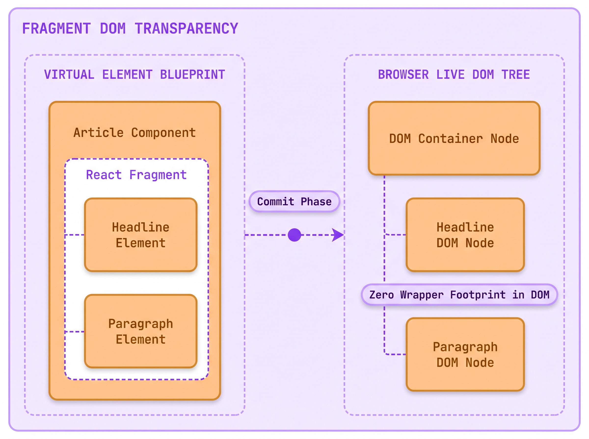
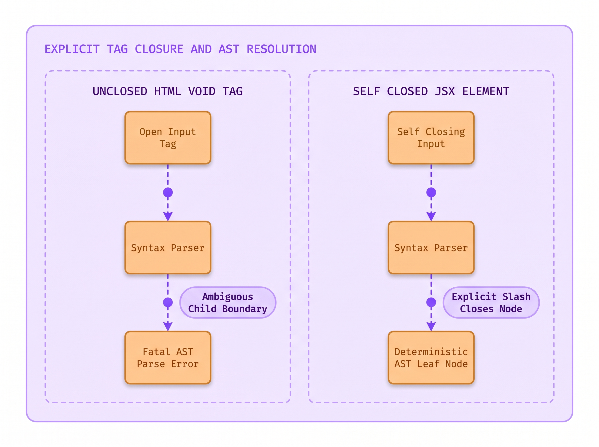
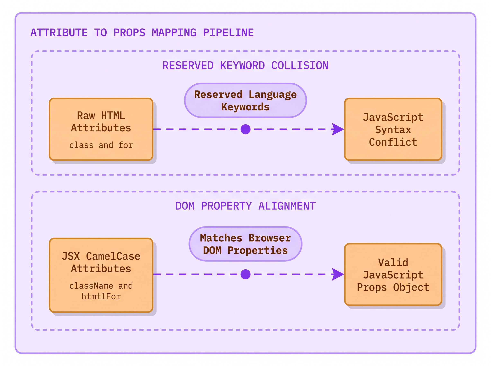
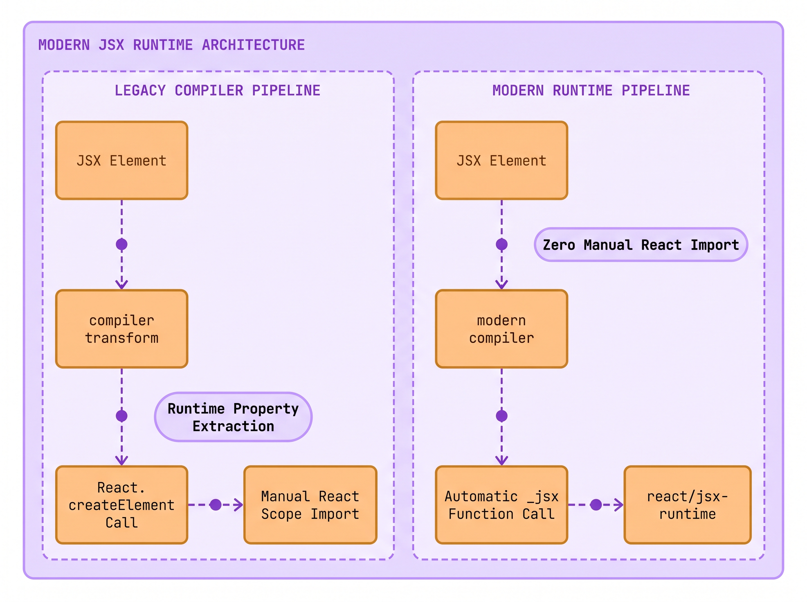

# Lecture 05: Why Pasting Raw HTML Fails in JSX
> INTERVIEW QUESTION | ❱ CORE | What is JSX, and what rules must every snippet follow?

1. David Ross, a digital producer at The National Times, migrated legacy newspaper article templates into React 19.
2. David copied a working HTML block containing an image, two paragraphs, and an editorial comment input.
3. He pasted the raw markup directly into the return statement of `ArticleBody.jsx`.
4. The local development server immediately crashed with three fatal compiler syntax errors.
5. The terminal reported unclosed image tags, adjacent root elements, and invalid property identifiers.
6. Why does working HTML markup fail to compile the moment you paste it into a React component?
7. Today you will uncover why JSX is stricter than HTML, and the three rules that govern every snippet.

### The Crime Scene: The Crashing Migration

You already know how to write standard HTML. You write opening and closing tags, add attributes like `class` and `id`, and paste images and inputs onto the page. The browser HTML parser is famous for its extreme forgiveness: if you forget to close an `` or `<input>` tag, the browser quietly fixes your mistake and renders the page anyway.

When developers begin learning React, their natural expectation is that they can copy their existing HTML markup and paste it directly into a component. After all, React documentation claims that components return markup.

When David Ross attempted this routine migration on *The National Times* news desk, his build environment crashed instantly.

David opened a legacy editorial template that had rendered cleanly on the production website for five years. He copied the markup, which contained a lead photo and a section heading. It also included two paragraphs of text and a reader feedback input. He pasted that markup into `ArticleBody.jsx` and saved the file.

Instead of displaying the article, the terminal erupted in bright red compiler errors:
- `Adjacent JSX elements must be wrapped in an enclosing tag. Did you want a JSX fragment <>...</>?`
- `JSX element 'img' has no corresponding closing tag.`
- `Invalid DOM property 'class'. Did you mean 'className'?`

**JSX is not HTML**.

**JSX (JavaScript XML)** is a syntax extension for JavaScript that lets you write HTML-like markup inside JavaScript files. While JSX looks almost identical to HTML, it is not interpreted by a browser HTML parser. Instead, JSX is a visual shorthand that compiles directly into standard JavaScript function calls.

Because JSX is transformed into JavaScript expressions, it cannot rely on the browser's forgiving HTML parser. It must obey the rigorous grammatical rules of the JavaScript programming language.

Every JSX snippet in your application must follow **The Three Immutable Rules of JSX**:
1. **Return a Single Root Element**: You must wrap adjacent elements in a single parent tag or a **React Fragment (`<>...</>`)**.
2. **Close All Tags Explicitly**: Void tags like `` and `<input>` must be explicitly terminated with a self-closing slash (``).
3. **camelCase Property Keys**: Attributes become keys of a JavaScript object, requiring reserved words like `class` to become `className`.

Here is the exact component that caused David's build to crash:

```jsx title="ArticleBody.jsx"
export default function ArticleBody() {
  return (
    
    <h2>City Council Approves Transit Plan</h2>
    <p>The municipal council voted in favor.</p>
    <p>Construction starts early next spring.</p>
  ); // **WRONG:** multiple adjacent roots, unclosed img tag, and reserved class keyword
}
```

```html-figure src="lab/01-forensic-investigator/figures/05-01-jsx-anatomy-explorer.html" caption="React Component Explorer showing ArticleBody using a Fragment root, self-closed tags, and camelCase attributes to render a clean editorial article."
```

When you examine the component explorer above, the clean resolution becomes immediately clear. By wrapping the article elements in a Fragment (`<>...</>`), closing the hero image tag with ``, and using `className`, the component compiles into a lightweight tree of virtual element descriptors.

To see why the raw HTML snippet caused the build compiler to abort, we must inspect each rule in detail.

### Rule 1: Return a Single Root Element

The first error David encountered was: `Adjacent JSX elements must be wrapped in an enclosing tag`.

Why does React demand that multiple JSX elements be wrapped inside a single parent container?

To answer this question, you must peel back the visual syntax and inspect the underlying JavaScript execution model. In JavaScript, a function can return only one value at a time. If you write `return a, b;`, the comma operator evaluates both but returns only `b`.

When the build compiler encounters a JSX tag, it transforms that tag into a function call: `_jsx('h2', { children: 'City Council Approves Transit Plan' })`.

This function evaluates and returns a plain, lightweight JavaScript object describing that node.

If you paste three adjacent sibling elements into your component without a parent wrapper, you are literally asking the JavaScript engine to return three separate objects from a single function return statement:

```javascript title="SyntaxFailure.js"
return (
  _jsx('img', { src: '/hero.jpg' })
  _jsx('h2', { children: 'Title' }) // Syntax Error: unexpected token
  _jsx('p', { children: 'Text' })
);
```

In standard JavaScript syntax, returning three expressions separated by whitespace without a container is a fatal syntax error. A function cannot return multiple values without wrapping them in an array or an object.



> [svg image] Under the single root return contract, **Adjacent Unwrapped Tags** fail because functions cannot return multiple values, whereas **Fragment Wrapped Tags** group elements into a single return object.

To solve this problem, you have two options. First, you could wrap the elements in a native parent element like a `<div>`:

```jsx title="ArticleBody.jsx"
export default function ArticleBody() {
  return (
    <div className="article-wrapper">
      
      <h2>City Council Approves Transit Plan</h2>
      <p>The municipal council voted in favor.</p>
    </div>
  );
}
```

This resolves the syntax error because the function returns a single `div` element that contains the children. But adding wrapper `div` tags everywhere introduces new problems. It clutters the HTML document with redundant DOM nodes, which can break CSS Grid and Flexbox layouts.

To return multiple sibling elements without creating an unwanted wrapper node in the browser DOM, React provides **Fragments**:

```jsx title="ArticleBody.jsx"
export default function ArticleBody() {
  return (
    <>
      
      <h2>City Council Approves Transit Plan</h2>
      <p>The municipal council voted in favor.</p>
    </>
  ); // **RIGHT:** grouped in a Fragment without adding DOM wrapper nodes
}
```

```html-figure src="lab/01-forensic-investigator/figures/05-02-html-vs-jsx-compiler-audit.html" caption="Symmetrical State Audit contrasting raw HTML compilation crashes against clean JSX AST compilation into a single Fragment descriptor."
```

In the compiler audit above, the two compilation paths illustrate the transformation clearly. The raw HTML block produces invalid JavaScript that crashes the abstract syntax tree parser. By contrast, wrapping the children in a Fragment compiles cleanly into `_jsx(Fragment, { children: [...] })`, preserving the layout structure without adding redundant wrapper nodes to the real DOM.



> [svg image] In the **Virtual Element Blueprint**, a **React Fragment** groups child elements together, but during the commit phase, nodes mount directly into the browser DOM with zero wrapper footprint.

To master JSX, we must deconstruct its foundational architecture across the four core pillars.

#### 1. Technical Nomenclature & Syntax Decoding
The acronym **JSX** stands for **JavaScript XML**. XML (Extensible Markup Language) is a strict data format that demands well-formed tree structures where every opening tag has an unambiguous corresponding closing tag. When you write `<Fragment>` or `<>`, you invoke the React Fragment symbol. When rendered, React unpacks the Fragment's child array and mounts each child directly into the parent container without creating an intermediary DOM node.

#### 2. Tactile Everyday Physical Analogy
Think of returning HTML elements from a function like checking groceries out of a supermarket. The cashier cannot hand you loose apples, oranges, and boxes of cereal individually into your bare hands; they would roll across the floor and cause chaos. You need a container. A `<div>` is like a heavy plastic grocery bag. It holds everything together, but you now have an extra physical bag sitting on your kitchen table. A React Fragment (`<>...</>`) is like a magician's invisible shrink-wrap band. It binds the fruits together while they pass through the checkout counter, but the moment you set them on your table, the band dissolves completely, leaving only the fruit.

#### 3. The "Why We Suffered Before" Contrast
Before JSX was introduced, constructing dynamic user interfaces in JavaScript required writing tedious nested function calls: `React.createElement('div', { className: 'card' }, React.createElement('h1', null, 'Title'))`. In large codebases, writing deeply nested function calls caused extreme visual fatigue. Developers struggled to visualize the resulting document structure. JSX restored the natural, visual hierarchy of markup while maintaining 100% of JavaScript's expressive power.

#### 4. The Physical Runtime Engine Routine
What does the JSX compiler do when it processes your file? The compiler parses your source text into an Abstract Syntax Tree (AST). It converts every `<Tag>` into a call to `_jsx(Tag, props)`. When a Fragment (`<>...</>`) is used, the compiler passes the built-in `Fragment` symbol as the first argument: `_jsx(Fragment, { children: [heroNode, headingNode, textNode] })`. At runtime, React's Fiber reconciler steps through the `children` array and links each child directly to the surrounding parent Fiber node.

> [!KEY]
> **The Single-Root Contract**: Every component must return a single root element because JavaScript functions can only return one value. Use a Fragment (`<>...</>`) to group sibling elements without adding extra wrapper nodes to the browser DOM.

### Rule 2: Close All the Tags Explicitly

The second error David encountered was: `JSX element 'img' has no corresponding closing tag`.

In standard HTML5, certain elements are designated as **void elements**. A void element cannot have child content. Common examples include ``, `<input>`, `<br>`, `<hr>`, and `<meta>`.

Because these elements cannot hold children, the HTML5 specification permits authors to leave them open:

```html title="legacy-article.html"

<br>
<input type="text" placeholder="Add notes">
```

The browser HTML parser knows by heart which tags are void elements. When it encounters ``, it inserts the image and immediately continues to the next tag without waiting for `</img>`.

In JSX, this forgiveness does not exist.

JSX enforces strict XML rules. In XML, every single tag must be explicitly closed. If a tag does not contain children, it must terminate with a self-closing slash: `/>`.

Here is the correct way to write void elements in JSX:

```jsx title="VoidElements.jsx"
export default function EditorialToolbar() {
  return (
    <div className="toolbar">
      
      <br />
      <input type="text" placeholder="Search archive..." className="search-input" />
      <hr />
    </div>
  ); // **RIGHT:** every void tag explicitly terminates with a self-closing slash
}
```

Why is JSX so strict about closing tags?

Because the JSX compiler is completely decoupled from the browser DOM. The compiler does not maintain an encyclopedia of HTML5 void tags. To the JSX parser, `<input>` could be a native browser element, or it could be a custom component named `<Input>` authored by another developer that accepts child elements.

If the compiler allowed unclosed tags, it would be impossible for the parser to know where that element's children end and where the next sibling begins. Requiring an explicit slash (`/>`) ensures that the abstract syntax tree can be parsed deterministically with zero ambiguity.



> [svg image] The JSX syntax parser requires explicit tag closure: an **Unclosed HTML Void Tag** creates boundary ambiguity that halts the parser, whereas a **Self Closed JSX Element** resolves deterministically into an AST node.

> [!WISDOM]
> **XML Rigor Protects the AST**: In JSX, every tag must be explicitly closed. Never write open void tags like `<input>` or ``; always append the self-closing slash: `<input />` and ``.

### Rule 3: camelCase Property Keys and Reserved Words

The third error David encountered was: `Invalid DOM property 'class'. Did you mean 'className'?`.

In HTML, you assign CSS styling classes using the `class` attribute, and you link form labels to inputs using the `for` attribute:

```html title="legacy-form.html"
<label for="subscriber-email" class="label-heading">Email Address</label>
<input id="subscriber-email" class="text-field" tabindex="1">
```

When you write JSX, attributes written on a tag do not remain HTML attributes. Instead, the compiler collects all attributes and packages them into a plain JavaScript object called **props**.

Here is what the compiler attempts to produce behind the scenes:

```javascript title="PropsCompilation.js"
_jsx('label', {
  for: 'subscriber-email',
  class: 'label-heading',
  children: 'Email Address'
});
```

Here is the fundamental conflict: in JavaScript, `class` and `for` are **reserved keywords**.

The word `class` is reserved for declaring object-oriented classes (`class User {}`). The word `for` is reserved for loop declarations (`for (let i = 0; i < 10; i++)`).

In earlier versions of JavaScript, using reserved words as unquoted object keys caused syntax errors in many browser engines. Furthermore, component authors frequently destructure incoming props:

```javascript title="DestructuringTrap.js"
function CustomLabel({ class, for }) { // Fatal Syntax Error: reserved keyword
  return <label className={class}>{...}</label>;
}
```

Because a developer cannot declare a variable named `class` or `for`, React aligns JSX property names with the standard DOM properties exposed by the browser's native JavaScript `Element` interface.

In the browser's native DOM API, the property to access an element's CSS class is named `element.className`, and the property to access a label's target ID is named `element.htmlFor`.

React adopted these exact property names for JSX:
- `class` becomes **`className`**.
- `for` becomes **`htmlFor`**.

Furthermore, JSX applies **camelCase** naming to virtually all standard HTML and SVG attributes:
- `tabindex` becomes **`tabIndex`**.
- `autocomplete` becomes **`autoComplete`**.
- `stroke-width` becomes **`strokeWidth`**.
- `onclick` becomes **`onClick`**.

The official React documentation explicitly states this requirement:

> JSX turns into JavaScript and attributes written in JSX become keys of JavaScript objects. In your own components, you will often want to read those attributes into variables. But JavaScript has limitations on variable names. For example, their names can't contain dashes or be reserved words like class. This is why, in React, many HTML and SVG attributes are written in camelCase.
*React Official Documentation (Writing Markup with JSX), `documentation official/React 19 Sept 2026/react.dev/src/content/learn/writing-markup-with-jsx.md`*



> [svg image] Attributes become keys of a JavaScript props object: raw HTML attributes like class and for trigger a **Reserved Keyword Collision**, while JSX attributes use **DOM Property Alignment** like className and htmlFor.

There is one important exception that every senior engineer must remember: **`aria-*` and `data-*` attributes**.

Attributes designed for accessibility (`aria-label`, `aria-hidden`, `aria-expanded`) and custom dataset values (`data-story-id`, `data-analytic-tag`) are written with hyphens in JSX, exactly as they are written in standard HTML:

```jsx title="AccessibleArticle.jsx"
export default function AccessibleArticle() {
  return (
    <article
      className="news-card"
      aria-label="Breaking news bulletin"
      data-story-id="metro-transit-2026"
    >
      <label htmlFor="comment-field" className="field-label">Add Comment</label>
      <input id="comment-field" tabIndex={1} className="comment-input" />
    </article>
  ); // **RIGHT:** className and htmlFor used with hyphenated aria-* and data-* attributes
}
```

Because `aria-*` and `data-*` are established W3C standards with hundreds of variations, keeping their hyphens prevents unnecessary translation friction for developers.

### The Senior Interview Masterclass: The Modern JSX Transform

In senior frontend interviews, interviewers frequently probe your understanding of the build pipeline:

> *"In older React tutorials, every file had to start with `import React from 'react'`. In modern React 19, why is that import no longer required for JSX, and how does the compiler transform `<div />` under the hood?"*

A junior developer might answer that React changed its rules or made the import automatic.

A senior engineer explains the fundamental evolution of the **JSX Transform**.

Prior to React 17, the JSX compiler transformed `<div className="box" />` into:
```javascript
React.createElement('div', { className: 'box' });
```

Because the compiled output explicitly referenced the global `React` variable, every single `.jsx` file was required to import `React` into scope. If an engineer forgot `import React from 'react'`, the browser threw a runtime ReferenceError: `React is not defined`.

Furthermore, `React.createElement` suffered from performance inefficiencies. It performed dynamic property checks and clone operations at runtime that could have been resolved ahead of time by the compiler.

In modern React (React 17, 18, and 19), the React team introduced the **New JSX Transform** in collaboration with Babel and TypeScript.

When modern compilers encounter `<div className="box" />`, they automatically inject an import from the hidden runtime package:

```javascript
import { jsx as _jsx } from 'react/jsx-runtime';

_jsx('div', { className: 'box' });
```



> [svg image] The **Legacy Compiler Pipeline** required manual React imports and dynamic property checks, while the **Modern Runtime Pipeline** automatically emits optimized calls from react/jsx-runtime with zero manual boilerplate.

This evolution delivers three major architectural benefits:
1. **Zero Boilerplate**: Developers never need to write `import React from 'react'` merely to author JSX markup.
2. **Bundle Optimization**: The compiler distinguishes between single-child calls (`_jsx`) and static child arrays (`_jsxs`), which allows the engine to optimize memory allocation.
3. **Decoupled Architecture**: JSX syntax is decoupled from the core `react` package, preparing the compiler for advanced static optimizations like the React 19 Compiler.

> [!TIP]
> **To impress the interviewer:** Highlight how **the automatic JSX runtime streamlines compilation and memory allocation**. Say: *"Modern React uses `react/jsx-runtime`. The compiler automatically produces `_jsx` and `_jsxs` calls instead of `React.createElement`. This eliminates the need to import React manually in every file. It also avoids runtime property extraction, and it lets the compiler pass children as optimized static arrays."*

### Where you will meet this

1. **CMS Migration Projects**: Converting legacy HTML editorial templates from legacy publishing systems into React 19 component trees.
2. **Accessible Form Design**: Authoring search bars and comment inputs using `htmlFor`, `className`, and `aria-*` attributes.
3. **SVG Icon Systems**: Porting vector SVG graphics into React components by converting hyphenated attributes like `stroke-width` into `strokeWidth`.
4. **Design System Tokens**: Building layout grids and button wrappers using Fragment tags to prevent unnecessary DOM depth.

### Glossary

- **JSX**: A syntax extension for JavaScript that allows developers to write XML-like markup that compiles into JavaScript object descriptors.
- **React Fragment**: An empty wrapper tag (`<>...</>`) that groups multiple sibling elements without creating an additional DOM element in the browser.
- **`className`**: The JSX attribute corresponding to the HTML `class` attribute, named after the browser's native DOM property.
- **`htmlFor`**: The JSX attribute corresponding to the HTML `for` attribute on `<label>` elements.
- **Void Element**: An HTML element that cannot hold children (``, `<input>`, `<br>`), which must be self-closed with a slash (`/>`) in JSX.
- **`react/jsx-runtime`**: The internal compilation runtime introduced in React 17 and used in React 19 to execute transformed JSX calls automatically.

### Summary

**The Rules of JSX**

JSX unifies markup structure with JavaScript execution, requiring strict syntax compliance to ensure deterministic abstract syntax tree compilation.

❒ The Syntax Invariants
1. JSX compiles into JavaScript function expressions:
<br>&nbsp;&nbsp;&nbsp;&nbsp;(a) Functions can only return one value, requiring all adjacent elements to be enclosed in a single root.
<br>&nbsp;&nbsp;&nbsp;&nbsp;(b) React Fragments (`<>...</>`) group sibling nodes without injecting redundant DOM wrapper nodes.
<br>&nbsp;&nbsp;&nbsp;&nbsp;(c) All tags must be explicitly closed, with void elements terminating in a self-closing slash (``).
2. Principles to remember:
➔ NEVER paste raw HTML into a component without converting void tags and reserved attributes.
➔ ALWAYS use React Fragments instead of useless wrapper `<div>` tags to keep the browser DOM shallow.

❒ The Attribute Contract
1. Attributes become property keys in JavaScript props objects:
<br>&nbsp;&nbsp;&nbsp;&nbsp;(a) Reserved words are replaced with DOM properties (`className` for `class`, `htmlFor` for `for`).
<br>&nbsp;&nbsp;&nbsp;&nbsp;(b) Standard HTML and SVG attributes use camelCase (`tabIndex`, `strokeWidth`).
<br>&nbsp;&nbsp;&nbsp;&nbsp;(c) Accessibility (`aria-*`) and data (`data-*`) attributes retain hyphens to match W3C standards.
2. Operational rule:
➔ IF an attribute name matches a JavaScript reserved keyword, THEN use its corresponding DOM property name in JSX.
➔ IF an attribute is an `aria-*` or `data-*` attribute, THEN preserve its hyphenated HTML format.

**DO NOT DO THIS:** Paste raw HTML with multiple roots, unclosed tags, and reserved keywords
```jsx wrong
function ArticleSnippet() {
  return (
    
    <label for="name">Author</label>
    <input type="text">
  );
}
```

**DO THIS:** Wrap siblings in a Fragment, self-close void tags, and use camelCase DOM attributes
```jsx right
function ArticleSnippet() {
  return (
    <>
      
      <label htmlFor="name">Author</label>
      <input type="text" id="name" />
    </>
  );
}
```

| | **Standard HTML5**<br>(Browser Parser) | **React JSX**<br>(JavaScript Compiler) |
| ---: | :--- | :--- |
| **Root Elements** | Multiple adjacent top-level tags are fully valid in HTML documents | Multiple adjacent tags must be enclosed in a single parent tag or Fragment |
| **Tag Closure** | Void tags like `` and `<input>` do not require a closing slash | All tags must be explicitly closed; void tags require self-closing slash (``) |
| **Class Attribute** | Written as `class="name"` in markup | Written as `className="name"` to avoid JavaScript `class` keyword collision |
| **Label For Attribute** | Written as `for="id"` on `<label>` elements | Written as `htmlFor="id"` to avoid JavaScript `for` loop keyword collision |
| **Attribute Casing** | Case-insensitive; standard attributes written in lowercase or kebab-case | Strictly camelCase (`tabIndex`, `strokeWidth`), except `aria-*` and `data-*` |
